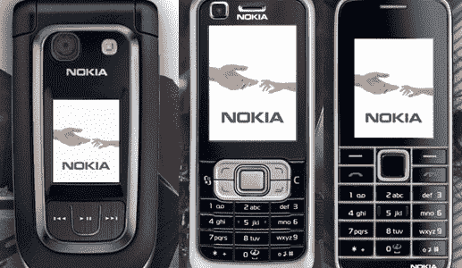

# 诺基亚发布低端手机

> 原文：<https://web.archive.org/web/http://techcrunch.com/2007/06/18/nokia-releases-low-end-phones-snooze-gasm/>

我差点没贴这个，但是 Fone 仙女让我贴的。诺基亚刚刚推出了三款手机，6267、6121 和 3500 经典款。这些手机实际上是面向中档用户的——基本上是免费手机——价格在 0 美元到 250 美元之间，取决于运营商的补贴。

翻盖式的 6267 有 4GB 内存和 200 万像素的摄像头。它也有 3G 功能。大约 260 美元。

3500 具有调频收音机和 200 万像素的摄像头以及即时消息功能。大约 150 美元。

6121 是使用 HSDPA，并在一个标准的糖果酒吧格式。它有一个 200 万像素的主摄像头和一个用于视频通话的前置摄像头。大约 280 美元。

大不了？那鸿我们会很快看到这些吗？大概不会。我们都回去吃午饭吧。

[诺基亚发布面向中端市场的 3500 Classic、6121 Classic 和 6267 *更新*](https://web.archive.org/web/20160206120205/http://www.intomobile.com/2007/06/17/nokia-releases-3500-classic-6121-classic-and-6267-for-the-mid-range-market.html) [IntoMobile]