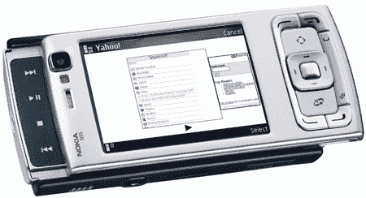

# 诺基亚即将推出新的 N95 固件

> 原文：<https://web.archive.org/web/http://techcrunch.com/2007/06/21/nokia-soon-to-roll-out-new-n95-firmware/>

诺基亚 N95 的用户将很快享受到该手机制造商的新固件。固件更新将包括新版本的诺基亚地图以及辅助 GPS，这是一种使用数据连接来估计手机位置的功能，可以更快地进行 GPS 定位。新固件的发布日期尚未公布。

[新的 N95 固件即将推出【Symbian-Guru.com ](https://web.archive.org/web/20150924131207/http://symbianguru.typepad.com/welcome/2007/06/new_n95_firmwar.html)