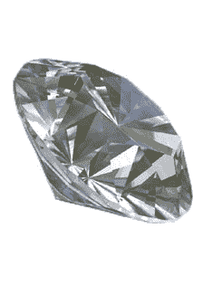

# 诺基亚致力于钻石外壳| TechCrunch

> 原文：<https://web.archive.org/web/http://techcrunch.com/2007/01/23/nokia-working-on-diamond-casing/>

# 诺基亚正在制作钻石外壳

我们都看过一部老电影，在这部电影中，窃贼用钻石切割窗户，闯入家中或商店。因此，我们现在都应该知道钻石非常坚硬。诺基亚知道这一点，并通过开发一种类似于钻石的外壳材料，很好地利用了这种珍贵的宝石。在诺基亚提交的一项专利中发现，这种外壳使用煤炭，摸起来很光滑。来自新科学家科技:

> “为了使这种物质通电，电流是通过煤石墨馈入的。这就产生了等离子体，通过高压电极将等离子体导向塑料外壳。煤离子穿透表面并结合形成厚度小于 100 纳米的无定形类金刚石涂层。这一过程在室温下进行，这意味着即使是廉价的塑料也可以用这种方式进行涂覆。”

看起来很成功。帮我报名诺基亚，我总是不小心弄坏我的小玩意。

[钻石涂层的小玩意](https://web.archive.org/web/20130628191048/http://www.newscientisttech.com/article/dn11003)【新科学家科技】