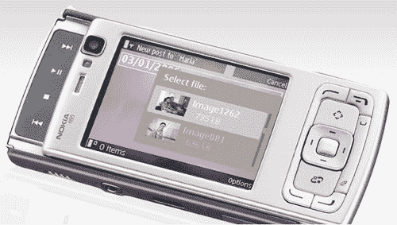

# 诺基亚的 N95“多媒体电脑”开始向世界各地发货，除了这里——TechCrunch

> 原文：<https://web.archive.org/web/http://techcrunch.com:80/2007/03/22/nokias-n95-multimedia-computer-starts-shipping-to-everywhere-but-here/>

# 诺基亚的 N95“多媒体电脑”开始运往世界各地，除了这里

诺基亚 N95，也被称为“ [fattie 媒体手机](https://web.archive.org/web/20220131221829/http://crunchgear.com/2007/02/12/nokia-now-with-youtube/)”，终于开始向欧洲和亚洲的重要市场发货。(当然，我们孤立无援。)诺基亚甚至没有把它作为手机来推销，而是作为“多媒体电脑”这个滑块有一个 500 万像素的摄像头，内置 GPS，支持移动宽带技术，如 HSDPA 和 EDGE。听起来像是手机。

N95 运行在 Symbian S60 上，做了许多苹果 iPhone 做的事情，只是没有触摸屏和比你更神圣的态度。

[新闻稿](https://web.archive.org/web/20220131221829/http://www.nokia.com/A4136001?newsid=1113533)【诺基亚】