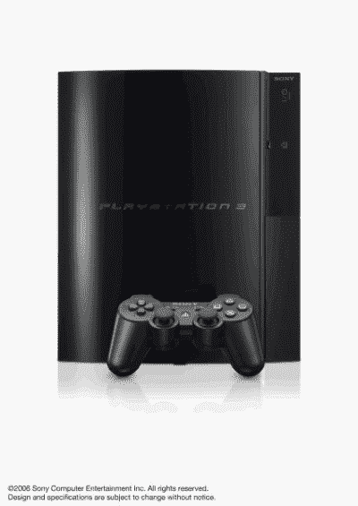

# 11 月:下一代游戏月

> 原文：<https://web.archive.org/web/http://techcrunch.com/2006/11/02/november-next-gen-gaming-month/>

# 11 月:次世代游戏月

现在我们已经看到了任天堂 Wii 和 PlayStation 3 的运行，是时候看看这些主机在发布日到底会给用户带来什么了。我们知道，未来我们将为 PlayStation 3 推出*metrolod 4*，任天堂 Wii 将推出新的*metrolod*，但这并不能真正帮助我们，因为游戏机距离发布还有 2 周，我们无法决定购买哪一款。对于每台主机，在发布日都将有一款大型独家游戏可用:PlayStation 3 将有*抗性:人类的堕落*，任天堂 Wii 将提供*塞尔达传说:暮光公主*，Xbox 360 将与 Epic 的*战争机器*进行较量。由于数百美元(和时间)悬而未决，我们已经将游戏机的大型游戏的游戏片段并排放置，所以我们可以看到一旦这些游戏机发布，我们实际上可以玩什么。

*   **任天堂 Wii**

*塞尔达传说:暮色公主*
 [https://web.archive.org/web/20130627211320if_/http://www.youtube.com/embed/KqUqxVKd5q0?version=3&rel=1&fs=1&showsearch=0&showinfo=1&iv_load_policy=1&wmode=transparent](https://web.archive.org/web/20130627211320if_/http://www.youtube.com/embed/KqUqxVKd5q0?version=3&rel=1&fs=1&showsearch=0&showinfo=1&iv_load_policy=1&wmode=transparent)

视频

*   **PlayStation 3**

*反抗:堕落之人*
 [https://web.archive.org/web/20130627211320if_/http://www.youtube.com/embed/8InBp28Lhv4?version=3&rel=1&fs=1&showsearch=0&showinfo=1&iv_load_policy=1&wmode=transparent](https://web.archive.org/web/20130627211320if_/http://www.youtube.com/embed/8InBp28Lhv4?version=3&rel=1&fs=1&showsearch=0&showinfo=1&iv_load_policy=1&wmode=transparent)

视频

*   **Xbox 360**

*战争机器 [https://web.archive.org/web/20130627211320if_/http://www.youtube.com/embed/Reurx8RdZrU?version=3&rel=1&fs=1&showsearch=0&showinfo=1&iv_load_policy=1&wmode=transparent](https://web.archive.org/web/20130627211320if_/http://www.youtube.com/embed/Reurx8RdZrU?version=3&rel=1&fs=1&showsearch=0&showinfo=1&iv_load_policy=1&wmode=transparent)

视频*

新的*塞尔达*预告片是否让任何人想起*冈美*？！你知道了，三巨头。我们不是任何一台游戏机的粉丝，但我不得不说，我对任天堂 Wii 比对其他任何东西都更感兴趣。