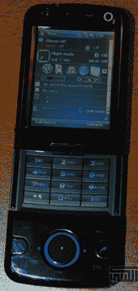

# O2 海伦:完全出乎意料，而不是 iPhone 

> 原文：<https://web.archive.org/web/http://techcrunch.com/2007/06/25/o2-helen-completely-out-of-the-blue-and-not-the-iphone/>

关于这款之前从未见过的来自 O2 的海伦手机，真的没有太多可说的。我可以说它有点像 HTC，但这可能只是因为它运行 WinMo 6，就像 [Wing](https://web.archive.org/web/20160520010302/http://crunchgear.com/2007/05/24/t-mobile-wing-second-look/) 。我也可以说，它的 3G-nessm，包括 UMTS，令人印象深刻，但这只是事实，因为我是一个美国人，他的国家拥有发达国家中最差的手机网络。或许我可以提一下，内置的 Wi-Fi，在某种程度上，使 3G 在今年晚些时候在亚洲推出时变得无关紧要。

但那会很无聊，我不想对你那样。

[海伦信息](https://web.archive.org/web/20160520010302/http://www.ce4arab.com/vb7/showthread.php?t=91013)【ce 4 Arab via[Electronista](https://web.archive.org/web/20160520010302/http://www.electronista.com/articles/07/06/25/o2.helen.in.the.works/)】