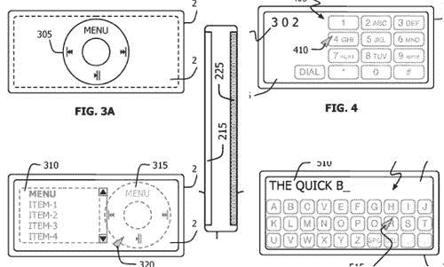

# 奇怪的 iPod 专利显示双屏，后触摸屏 TechCrunch

> 原文：<https://web.archive.org/web/http://www.techcrunch.com:80/2007/05/10/odd-ipod-patent-shows-dual-screens-rear-touchscreen/>

# 奇数 iPod 专利显示双屏，后触摸屏

关于苹果公司申请的一项奇怪的 iPod 专利，互联网上一片哗然,该专利描述了一种播放器前后都有屏幕的设备。这项专利结合了 Sprint 的[风头](https://web.archive.org/web/20220701150139/http://crunchgear.com/2007/03/26/samsung-upstage/)和 iPhone 的，描述了一个后触摸屏接受输入并将输入反映在前屏幕上的界面。困惑了吗？

它是这样工作的。因为纳米尺寸的设备太小，无法实现真正的正面触摸界面，背面的触摸屏可以感应你的手指位置，并在正面屏幕上显示你的手指或拇指所在的位置。这释放了前端空间，并可能允许屏幕键盘和其他好东西。可能吗？是的。会很快发生吗？大概不会。

这一切都是不切实际的猜测，但它确实展示了未来纳米尺寸 iPhone 的潜在设计，并为苹果制造了巨大的谣言。