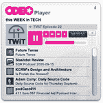

# Odeo 推出仪表盘小工具 TechCrunch

> 原文：<https://web.archive.org/web/http://www.techcrunch.com:80/2005/09/16/odeo-launches-dashboard-widget/>

# Odeo 推出仪表板小工具

Odeo 的家伙们刚刚发布了一款[仪表盘小工具](https://web.archive.org/web/20221001144939/http://odeo.com/listen/widget)，供想要直接从桌面上收听播客的 mac 用户使用。由于其性质，它是 OSX 老虎只-即使与雅虎小工具，它不应该有太多的工作去为 Windows 太多-但如果你在你的机器上运行它，请务必检查它。

看到公司接受操作系统的新功能并在其中发挥创造力总是件好事。此外，很高兴看到 Odeo 的人没有坐下来继续研究我们播客爱好者可以使用的酷东西。太好了！