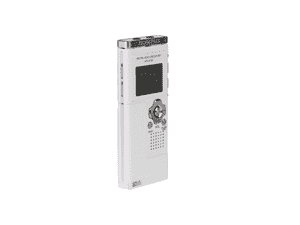
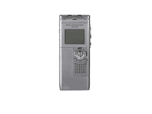

# 奥林巴斯发布两款终极混合录音机

> 原文：<https://web.archive.org/web/http://techcrunch.com/2007/08/08/olympus-announces-two-ultimate-hybrid-voice-recorders/>

# 奥林巴斯宣布两个终极混合录音机

现在还有人用录音笔吗？哦，是的，乔希还在用，但他是个真正的记者。如果我们的观众中有人还在使用它们，那么请注意奥林巴斯已经发布了不是一个，而是两个“终极”混合录音机。老实说，录音机很无聊，除非你加入 MP3 播放器和额外的存储空间，对吗？这正是奥林巴斯在 WS-321M 和 WS-311M 上所做的。

如果你在过去使用过录音机，那么你已经准备好使用它们了。只需通过 USB 插入您的虚拟现实，您需要的所有内容都可以轻松传输。液晶显示器也是一个很好的补充，让你了解正在发生的事情。321M 有 1GB 的内部存储空间，相当于 277 小时的录制内容或 250 首歌曲。311M 只有 516MB，大约能容纳 138 小时的录制内容或 120 首歌曲。两者都提供一节 AAA 电池长达 21 小时的运行时间。预计奥林巴斯二人组将于 9 月上市，售价分别为 149.99 美元(3.21 亿英镑)和 99.99 美元(3.11 亿英镑)。