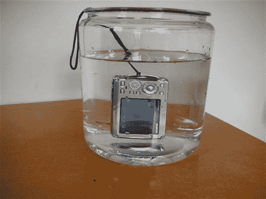
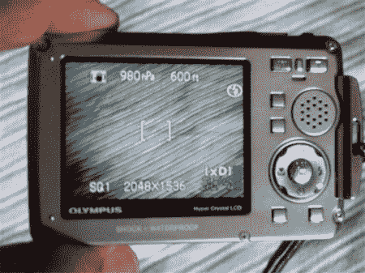
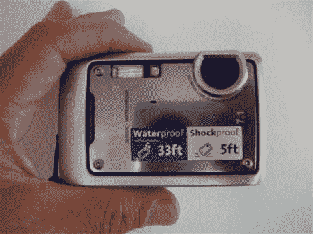
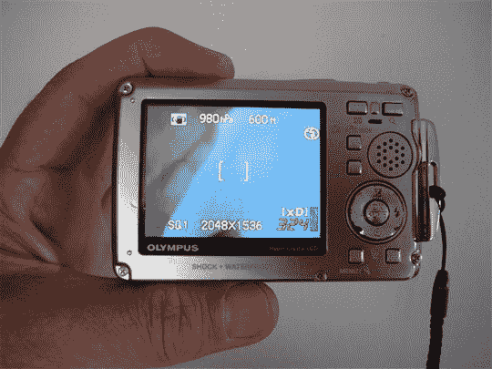
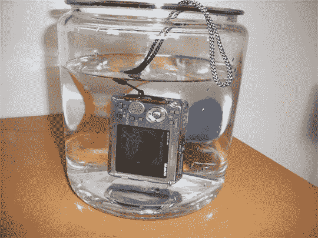

# 奥林巴斯手写笔 770SW 评论| TechCrunch

> 原文：<https://web.archive.org/web/http://techcrunch.com/2007/07/25/olympus-stylus-770sw-review/>

我敢打赌，每个阅读《嘎吱嘎吱》的人都有一台数码相机。他们是微妙的小东西，他们不喜欢滥用。事实上，我甚至敢打赌一群年轻人虐待过这些可怜的小家伙。Olympus Stylus 770SW 是为积极的人设计的，将很好地为您服务。

在这个小数码相机里有一个强悍的家伙。有多难？它足够坚硬，可以浸泡在水下，并且隔热到你可以把它放在外面的雪地里。据说它能在 14 度左右的温度下工作。你甚至可以把它扔到离地面五英尺的地方，它仍然可以工作。这款相机的金属外壳非常坚固，可以承受高达 220 磅的压力而不会塌陷，即使一个把它放在后口袋的大个子坐在上面也不会塌陷。

770SW 有一些令人印象深刻的数据，而不仅仅是炒作。它很轻，重量刚刚超过 6 盎司，尺寸很小，只有 3.6×3.3×0.8 英寸。有一个 710 万像素的 3 倍光学变焦。

与其前身(720SW)相比，770SW 将 2.5 英寸 LCD 像素从 115，000 增加到 230，000，使显示器在明亮的光线下更易观看。图片质量也有所提高，但仍然不如同价位的其他数码相机清晰(也不差)。关于噪音，770 处理得很好，直到 ISO 400。一旦你达到 400 ISO，你会注意到清晰度稍微下降。当你到了 ISO 800，锐度损失增加，阴影细节也受到影响。它 800 ISO 我还注意到一些轻微的颜色变化。

我发现颜色是正确的，但有点低调。没有手动曝光控制，但你可以调整白平衡和灵敏度。它有 27 种拍摄模式，包括四种水下模式。我不喜欢的一点是，无论你的模式设置是什么，相机在启动时，不会恢复到上次使用的设置。因此，每次相机启动时，您都必须导航到之前的设置。这是一个痛苦的屁股，因为你必须按下按钮两次，然后才能选择场景模式。另一个不好的导航选择是电影模式在场景模式里面，是最后一个选择。

**快速启动**
它启动很快，大约一秒钟，两次出手之间的时间刚好超过两秒钟。使用闪光灯时，数字为三秒，快门延迟不到一秒。非常重要和必要的是图像稳定功能。

我做的第一件事就是把它扔进游泳池。我等了半分钟，喝了一大口啤酒，然后一头扎了进去。上来就给女朋友拍了一张，还不错(我女朋友)，相机还能用。这款相机防水深度可达 33 英尺。

奥林巴斯 770SW 是好看和强硬的，就像我一样，但也像我一样，它有一些问题。我不喜欢它不能恢复到启动时的最后设置。不得不通过菜单进入适当的模式是令人讨厌的。我会说菜单很直观，很容易使用。按钮很小，但相机也很小。我可以看到按钮在水下使用或在冬天戴手套时是个问题。

有了这些抱怨，我不得不说这是一个坚固的，好看的相机。它足够坚韧和多功能，可以被认为是一个伟大的行动相机，你可以把它带到任何地方。我愿意考虑这样一个事实，你不可能满足所有人的所有要求，770SW 的主要特点是坚固耐用。奥林巴斯 770SW 会舔舔，继续拍。