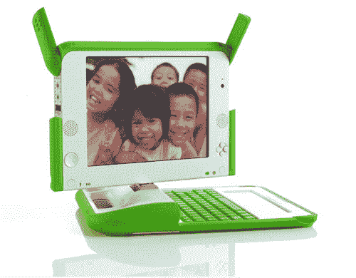

# 在不到两年的时间里，每个孩子一台笔记本电脑只需 50 美元| TechCrunch

> 原文：<https://web.archive.org/web/http://techcrunch.com/2007/07/06/one-laptop-per-child-laptop-to-cost-only-50-in-less-than-two-years/>

你知道那些 100 美元的笔记本电脑是“每个孩子一台笔记本电脑”项目的一部分吗？这个项目是在 OLPC T4 进行的。你知道，就是那些只要转动曲柄就能产生干净的水和最佳生活条件的水？据该倡议的首席技术官称，在不到两年的时间里，它们只需花费 50 美元。好消息，各位。

我甚至不想假装了解非营利组织。因此，我会静静地坐在这里，为 OLPC 集团至少努力改善全世界贫困人口的生活而鼓掌。快乐的感觉-星期五快乐！

[OLPC ASP 最终缩减至 50 美元](https://web.archive.org/web/20160308121852/http://www.digitimes.com/news/a20070704PD218.html)【Digi Times via[Tech Tear](https://web.archive.org/web/20160308121852/http://www.techtear.com/2007/07/06/las-laptops-de-olpc-costaran-50/)】