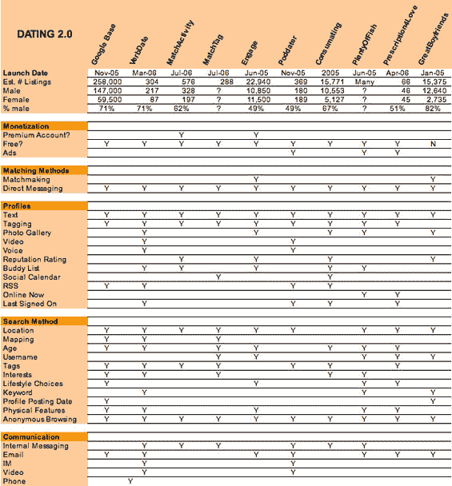

# 在线约会 2.0:寻找爱情的十三个网站

> 原文：<https://web.archive.org/web/http://www.techcrunch.com:80/2006/07/23/online-dating-20-thirteen-sites-to-find-love/>

在线约会是一项大生意，2006 年 6 月，每天吸引大约 400 万美国互联网用户(每月 2500 万)，他们平均每天在这些网站上花费近 17 分钟。这意味着大量的页面浏览量——几乎每月 45 亿次(来源:康姆斯克)。这还没有考虑到每天 10 亿次的 Myspace 页面浏览量，许多人认为这基本上是一个非常大的约会网站。总的来说，至少有 15%的美国互联网用户每月都会访问一个在线约会网站。

最大的两个交友网站分别是雅虎交友网和 Match.com，每月访客总数为 930 万。两者都允许免费浏览，但要与其他成员交流，你必须付费。Match.com 的基本计划每月收费 30 美元；雅虎的收费是 25 美元/月。这两个网站还提供额外的计划，试图帮助你找到一个合适的伴侣。

一整批下一代约会网站已经出现，开始对现有的玩家产生影响。其中一个名为 PlentyofFish 的网站于 2003 年推出，每月有超过 50 万的美国访客。最近，甚至谷歌也通过他们的[谷歌基地](https://web.archive.org/web/20210918140232/http://www.beta.techcrunch.com/2005/11/15/google-base-launched-yuck/)产品进入了这个领域。

一个很大的区别是，这些网站(大部分)是免费的，仅从广告销售中获得收入。但是这些网站中的许多也在尝试新的方法来介绍可能是很好的匹配的人。更多信息请见下文。

**消耗**

2005 年夏天推出[的](https://web.archive.org/web/20210918140232/http://www.beta.techcrunch.com/2005/08/13/profile-consumating/)[消费](https://web.archive.org/web/20210918140232/http://www.consumating.com/)，2005 年 12 月收购[，上个月](https://web.archive.org/web/20210918140232/http://www.beta.techcrunch.com/2005/12/07/cnet-acquires-consumating/)[重新推出](https://web.archive.org/web/20210918140232/http://www.beta.techcrunch.com/2006/06/07/cnet-relaunches-consumating/)，拥有新的界面和功能。它的口号是“找到不差劲的人”，标签在这项服务中发挥了重要作用。消费显然是针对年轻的潮人，他们可以通过回答问题来填写个人资料，让自己更“受欢迎”。用户通过宽松的年龄范围(20 岁、30 岁等)进行搜索。)和标签来寻找朋友和伙伴。该网站还试图通过各种竞赛和每周用户测验来吸引用户。其他消费特性包括一个[小部件](https://web.archive.org/web/20210918140232/http://www.consumating.com/everywhere/)，它根据您设置的参数(everyone、zipcode、by tag)将成员信息传输到网页。该网站也有留言板功能。我们在下面包含了一个版本的小部件。

var widget = new consumeatingwidget()；
widget . random profile()；

。csm_badge {背景:# FFF；边框:1px 纯色# 666；填充:0px 边距:0px}
。CSM _ badge _ vertical { background:# FFF；填充:0px 边距:0px}
。CSM _ badge _ horizontal { background:# FFF；填充:0px 边距:0px}
。CSM _ wrapper { width:152 px；填充:0px 边距:0px 位置:相对；font-family:“Trebuchet MS”，Trebuchet，“Lucinda Grande”，verdana，arial，helvetica，sans-serif；
}
。CSM _ horizontal _ wrapper { width:502 px；填充:0px 边距:0pxfont-family:“Trebuchet MS”，Trebuchet，“Lucinda Grande”，verdana，arial，helvetica，sans-serif；
}
。CSM _ vertical _ wrapper { width:52px；填充:0px 边距:0pxfont-family:“Trebuchet MS”，Trebuchet，“Lucinda Grande”，verdana，arial，helvetica，sans-serif；
}
。CSM _ wrapper a { color:# 0 a6；}
。csm_wrapper。徽标{ text-align:居中；border-top: 1px 虚线# 666；}
。CSM _ break { height:1px；明确:两者都有；}
。CSM _ row { padding:0px；文本对齐:左对齐；边距-底部:5px 最小高度:50px 高度:50px}
。csm_row_txt { position:相对；左:60px 宽度:90px 字体大小:12px}
。CSM _ row _ pic { position:absolute；左:0px 宽度:55px}
。CSM _ txt { padding:5px；文本对齐:居中；}
。CSM _ card { border:solid # 666 1px；宽度:110px 身高:145px 文本对齐:居中；字体大小:11px 填充顶部:5px 背景:# FFF；保证金:5px}
。CSM _ profile { text-align:center；填充:10px}

widget . first profile()；
for(I = 0；I<widget . profile count(10)；i++){
document . write(widget . profile link(widget . photo(1，50)))；
widget . next profile()；
}

**接合**

寻求通过牵线搭桥的方式撮合情侣。用户用通常的描述性资料注册，然后扮演“约会者”或“媒人”(或两者兼有)的角色。事实上，Engage 使用自己的会员来撮合其他人，这是他们的关键优势，并给了该网站一种病毒式的接触——甚至非会员也可以被建议进行匹配。

用户既可以作为媒人浏览，推荐他们的朋友，也可以作为约会者寻找特别的人，让男伴介绍他们。然而，约会者也可以直接互相发电子邮件。新增功能包括用户对潜在情侣的兼容性以及约会者和媒人的声誉进行投票。Engage 将向会员收费，但目前提供 6 个月的免费试用。非相亲对象可以免费使用该网站。

**谷歌征友**

Google Base(TechCrunch profiles[这里是](https://web.archive.org/web/20210918140232/http://www.beta.techcrunch.com/tag/Google_Base/))允许用户输入[高度针对约会的个人资料](https://web.archive.org/web/20210918140232/http://base.google.com/base/search?a_n0=people+profiles&a_y0=9&hl=en&gl=US)(字段包括性别、婚姻状况、性取向等)。).其他功能包括标签(tags)、简短描述、位置映射和匿名电子邮件。到目前为止，personals 部分主要用作热门与否和 FindingSingles.com 的个人信息聚合器，这是批量上传功能的结果。此外，想要幽默一点，看看达米恩·穆里的这篇关于如何使用谷歌泡妞的文章。

**伟大的男朋友**

2005 年被 TheKnot 收购的 great 男友公司试图消除网上约会固有的夸张(或谎言)因素。朋友、家人和前任被要求留下对他们的反馈。然后，GBF 验证背书或删除背书。一个关键的卖点是，已婚或因其他原因无法交往的人不会使用这个网站。

在推荐的指引下，用户可以自己搜索，或者为朋友推荐匹配的项目。该网站通过免除一周每月 20 美元的推荐订阅费来推动推荐，并通过为非用户创建账户来增加用户。

match activity

[MatchActivity](https://web.archive.org/web/20210918140232/http://matchactivity.com/) 是一个新网站，在介绍之前设置一个日期。用户通过标签发布他们所在区域的活动，然后选择他们最喜欢的回答者并执行计划。新增的功能允许您添加好友、评估用户的可靠性、向特定的人发出邀请，并在您欣赏的某个人发布活动时收到通知。对于一个基于活动的网站来说，令人惊讶的是没有日期/时间过滤功能，而且缺乏标准的消息传递功能，很难使用该服务来与使用该网站的成功约会保持联系。见正面评论[此处](https://web.archive.org/web/20210918140232/http://mashable.com/2006/07/10/match-activity-launches-online-dating-site/)。MatchActivity 是免费的，但提供 8 美元/月的高级版本，允许在活动计划之外进行一对一的交流。

match tag

MatchTag 拥有与 MatchActivity.com 相同的核心活动标签功能，但将其包装在一个更完整的社交网络中。用户向公众发布活动，并从受访者中选择合作伙伴，但也有更完整的消息传递和评论功能，以填充活动之外的用户体验。这是因为 MatchTag 的创始人将它视为一项服务，不仅是为了结识新的约会对象，也是为了结识你所在地区的朋友。MatchTag 新增的日历功能不仅可以轻松找到你喜欢的活动，还可以发现新的活动。

**明列诺**

来自 BlueLithium 的新公司 MingleNow 正在筹备中。您可以将您的电子邮件添加到主页进行更新，或者在此处查看他们的博客。来自测试人员的早期报告称，MingleNow 的目标是加入线上和线下的社交聚会。在 MingleNow 上注册的用户将根据他们在现实世界中经常出没的地点(酒吧、餐馆、咖啡馆等)对自己进行分组。)这样团体可以在线和离线交流。该网站还将包括一个评级系统，以衡量成员的剥落以及其他指标。我们期待着在它发布时对其进行评估——它可能对非约会社交也很有帮助。

**丰饶的鱼**

PlentyOfFish 最初是 Markus Frind 自学 ASP 的一种方式，但很快发展成为一个非常大的约会网站，每月有近 60 万美国独立访问者(康姆斯克)，[声称每月有 5 亿页面浏览量](https://web.archive.org/web/20210918140232/http://plentyoffish.wordpress.com/2006/06/10/microsoft-aspnet-20-performance/)(康姆斯克说在美国只有 1.18 亿)。它的外观和感觉有些粗糙，但它给了用户他们想要的东西:免费浏览个人资料的能力。PlentyOfFish 还制作了一个简单的公告板系统，允许用户自由聊天，发泄不满，并提供约会建议。该网站在财务上做得非常好。

 **我们在 2005 年 12 月写了关于[的](https://web.archive.org/web/20210918140232/http://www.poddater.com/)。基本想法是允许人们创建个人资料视频，并允许其他人下载和观看。稍微夸张一点，他们还假设人们会把这些下载到他们的视频 iPod 或其他视频设备上，然后在那里观看。这是一个相当标准的查看个人资料/联系用户类型的网站。用户可以通过位置、年龄和标签进行浏览。当你发现你感兴趣的人时，你可以给他们发信息，或者通过订阅他们的 RSS 源来表达你的钦佩。注意:很多简介都没有视频，我们的观点是，Poddater 太小众了，不会成功。

**规定爱情**

上周我们写了关于这个的文章。“爱情”是一个小众网站，致力于帮助那些面临特殊疾病污名的人，比如耳聋、艾滋病或肥胖。它帮助会员找到更好的浪漫伴侣，允许他们公开自己与潜在伴侣的状况，同时保持匿名，直到用户相互信任。总的来说，该网站的搜索功能可以根据个人特征和特定条件找到你所在地区的人，但缺乏对个人资料的可视化定制，而这种定制可以有效弥补照片的不足。评论者还建议允许搜索多个条件。

**RateOrDate**

RateOrDate 是一个元约会搜索网站，提供情侣评级、单身活动列表和约会网站目录。用户可以使用目录找到最符合他们需求的约会网站。谷歌地图混搭让约会者可以找到他们所在地区的单身活动。最后，用户可以根据照片和简短的简介来评价潜在的情侣可比性。他们也有一个很好的跟踪约会网站趋势的 T2 博客。总的来说，我们发现这个网站有点混乱，缺乏实际效用。

VerbDate

VerbDate 是一个新的约会网站，于 3 月份推出，它通过 Skype 为通常的在线约会体验增加了声音。Verbdate 拥有带标签的普通用户资料，但加入了 Flickr 相册，不仅允许用户发送电子邮件和即时消息，还可以通过互相“眨眼”来发起 Skype 通话。总之，VerbDate 允许最大程度的互动，同时保持物理隔离。然而，该网站只有 117 个简介，并且有一些负面评论。不过，它还很嫩，需要时间充分烘烤。

**维基征婚启事**

Wikia Personals 尚未推出，但旨在创建一个免费的全球个人主页。到目前为止的讨论都是针对一个允许用户根据语言、性别、宗教等领域搜索个人资料的网站。请继续关注这个社区创建的网站的更多发展。我们之前的维基帖子在这里，我们对首席执行官吉尔·彭奇纳的播客采访在这里。

**总结**

我们已经包括了一个功能概要表，但是，坦率地说，这样一个服务的客观分类对那些只想寻找约会对象的用户来说可能没有什么价值。个人资料的数量很重要——在这种情况下，PlentyofFish，一个基本但免费的服务，领先群雄。如果你正在寻找一种更有条理的约会方式，试试那些提供基于活动的会议或相亲的网站。我们预期的最爱是 MingleNow——将社交与现实世界的聚会联系起来是个好主意。上面的大多数网站也支持同性恋搜索。

**