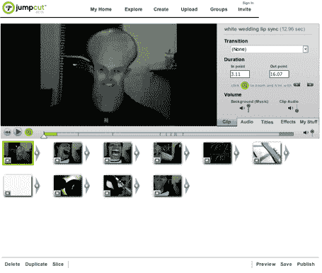

# 在线视频网站:像兔子一样繁殖

> 原文：<https://web.archive.org/web/http://www.techcrunch.com:80/2006/04/05/online-video-sites-breeding-like-rabbits/>

  我刚宣布 [Motionbox](https://web.archive.org/web/20210918132047/http://www.beta.techcrunch.com/2006/04/02/motionbox-best-online-video-sharing-so-far/) 是最好的在线视频分享服务(主要是因为它的编辑和深度标签工具)，一个新的竞争者就出现了。总部位于旧金山的秘密创业公司 [Jumpcut](https://web.archive.org/web/20210918132047/http://www.jumpcut.com/) ，由迈克·福尔格纳和瑞安·坎宁安创立，几分钟前刚刚推出。

在我看来，现在有两种截然不同的视频分享服务。第一个是 YouTube crowd 和它的几十个克隆版本，允许轻松上传文件，然后转换成 flash，并标记这些文件。我们的目标是获得视频和页面浏览量，这很有效。

事实上，它运行得如此之好，以至于对他们的商业模式提出了质疑。YouTube 是免费的，但是播放这些视频需要很高的带宽成本。他们用两种方式处理这个问题——通过降低 flash 视频文件的质量来减小文件大小，以及[从红杉](https://web.archive.org/web/20210918132047/http://www.businessweek.com/the_thread/blogspotting/archives/2006/04/youtube_raises.html)再筹集 800 万美元，使总数达到[1150 万美元](https://web.archive.org/web/20210918132047/http://gigaom.com/2006/04/05/youtube-snags-another-8-million/)。

第二组做 YouTube 做的事情，但也有一些基本的编辑功能。这个群体中包括 Grouper、Motionbox、Jumpcut 以及某种程度上的 YouTube。Grouper 和 VideoEgg 需要下载客户端才能使用这项服务。Motionbox 和 Jumpcut 没有，尽管 Jumpcut 说他们很快会有一个选项。通过后两种方式，编辑可以在线进行，因此有助于一组人对共享视频进行编辑。

作为最新进入者，Jumpcut 有一些非常引人注目的功能，这应该会鼓励用户之间的视频混合。它的编辑功能也使用了 Flash，比我用 Motionbox 看到的要好。可以克隆任何视频(除非发布者限制)，并且可以将其他剪辑添加到克隆的视频中。可以添加声音文件来覆盖现有的音频或与之混合。它们还允许一些“过渡”特征作为效果。总的来说，这很酷。点击[该视频屏幕](https://web.archive.org/web/20210918132047/http://www.jumpcut.com/view?id=391632888EA411DAAA45BA90607CBD2D)上的“混音”即可查看。

像 YouTube 一样，完成的视频可以保密、共享或公开。Jumpcuts 提供代码片段，允许从博客和其他网站播放视频。与 Motionbox 不同，Jumpcut 没有深度标记功能，尽管 Mike Folger 说它正在构建中，并且“使用 Flash 开发工具相当简单”。

这项服务目前是免费的，允许上传高达 50 MB 的内容(YouTube 允许 100MB)。付费服务将很快推出，每月 5 美元，Jumpcut 还将安装一个客户端，允许用户在上传到 Jumpcut 服务器之前进行一些编辑和转码工作。

总的来说，这项服务与 Motionbox 惊人地相似。Jumpcut 的编辑功能稍微好一些，Motionbox 的深度标签是一个明显的优势。这两种服务对于从一个团体事件中创建一个单独的视频都非常有用，在这个团体事件中，许多不同的人正在录制视频——例如，一个婚礼。Jumpcut 获得了 Westlake Venture Partners 和 Great Oaks Capital 的天使投资。

