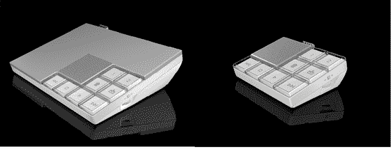

# Ooma 推出免费消费者电话服务

> 原文：<https://web.archive.org/web/http://www.techcrunch.com:80/2007/07/18/ooma-launches-free-consumer-phone-service/>

  一家雄心勃勃且被期待已久的新消费者网络电话初创公司——[Ooma](https://web.archive.org/web/20210801150928/http://www.crunchbase.com/company/ooma)——于周四上午发布。就像 Vonage 和命运多舛的 SunRocket 一样，Ooma 允许消费者使用普通手机拨打和接听电话，但价格大幅降低。

Vonage 在美国和加拿大提供无限制通话，每月固定费用为 25 美元。然而，Ooma 正在使用一种创新的点对点架构来显著降低他们的成本开销。由于成本降低，他们只对硬件收费。在美国打电话是免费的，而且将永远免费。

然而，这并不意味着消费者没有成本。你仍然需要购买起价 399 美元的硬件，并且要有宽带网络连接。这就为你买了一个基础中枢。你把宽带以太网插到一端，普通电话插到另一端，一切都准备好了。

如果你购买额外的单元，称为侦察兵，你可以用 Ooma 连接你的整个房子。这是相对于 Vonage 的另一个明显优势，Vonage 只允许一部手机插入设备。将 Ooma 侦察兵分散在房子周围，将一端插入普通的电话插孔，并将其与普通电话连接。这是 Ooma 系统的一部分，所有的电话都是免费的。

Ooma 不像 Vonage 那样使用普通交换机来终止呼叫，而是尽可能通过其他用户的电话线来路由呼叫。这为他们节省了通话的终止费用，并消除了他们最大的边际成本。这确实意味着，如果你有一条普通的电话线(不要求使用 Ooma ),它将被其他 Ooma 用户使用，但你不会注意到这一点，因为你的呼入和呼出电话都是绕过它的。如果你拨打 911，任何使用你的电话线路的电话都会立即中断，你的电话就会被接通。如果在你的电话被终止的 12 英里内没有 Ooma 用户，Ooma 使用正常的电话系统。从打电话的人的角度来看，这一切都是看不见的。

Ooma 硬件既美观又实用。应答机功能通过物理按钮内置于中枢和侦察设备中。每个 Ooma 帐户还包括两条线路，并且可以从任何一部电话接入。扬声器电话也是内置的。

Ooma 不只是在硬件上赚钱。随着时间的推移，他们会增加额外的付费功能。其中最有趣的是铃声，允许人们为来电定制铃声。这通常被认为是手机独有的功能。我可以想象其他手机类型的服务也会随着时间的推移而增加，可能还有 Ooma 品牌的手机。

如果你选择保持你的普通电话线路，我建议你把你的通话计划改成最基本、最便宜的选择。基本上是紧急情况下的 911 备份。

  Ooma 有一个[很深的](https://web.archive.org/web/20210801150928/http://www.ooma.com/management_team.php)管理团队和董事会，经过两轮融资已经融资[2700 万美元。](https://web.archive.org/web/20210801150928/http://www.crunchbase.com/company/ooma)

几天前，我有机会采访了创始人兼首席执行官安德鲁·弗雷姆和创意总监阿什顿·库彻(是的，就是那个演员)。库彻积极投身于这项业务——他的部分工作将包括创建一个病毒式视频系列来推广产品。播客在 TalkCrunch 上发布。除了 Ooma，我和 Ashton 还绕了一小段路，聊了聊 iPhone(他大部分时间都很喜欢)和他即将与 Cameron Diaz 合作的电影。

该产品目前处于私人测试阶段，我们将在明天送出一些 Oooma。它们在九月上市。

