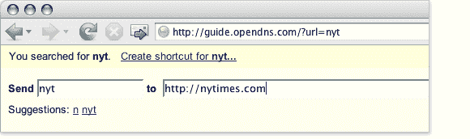

# OpenDNS 增加快捷服务

> 原文：<https://web.archive.org/web/http://www.techcrunch.com:80/2007/04/23/opendns-adds-short-cut-service/>

DNS 很无聊，但是 [OpenDNS](https://web.archive.org/web/20170814122414/http://www.opendns.com/) 增加了一个新的快捷功能，让你无需输入就能访问网址。快捷方式是你最喜欢的网站的简短的多字母缩写。您可以直接键入“NYT”，而不是键入“www.nytimes.com”你也可以为流行的搜索网站创建快捷方式(例如，用“g monkeys”在谷歌上搜索猴子)。

在[嘎吱嘎吱齿轮](https://web.archive.org/web/20170814122414/http://crunchgear.com/2007/04/23/opendns-the-ultimate-in-short-cut-coolness/)了解更多信息。