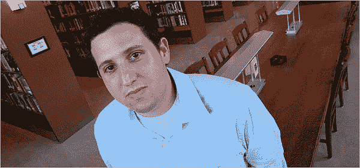

# OpenDNS 负责人 David Ulevitch 在 NYT 的简介| TechCrunch

> 原文：<https://web.archive.org/web/http://techcrunch.com:80/2007/07/09/opendns-honcho-david-ulevitch-profiled-in-nyt/>

你会从这个人那里买域名吗？嗯，你不需要。

我们喜欢一些 OpenDNS。这很有用——新的[“捷径”功能](https://web.archive.org/web/20160531213124/http://crunchgear.com/2007/04/23/opendns-the-ultimate-in-short-cut-coolness/)和 [pR0n 阻塞](https://web.archive.org/web/20160531213124/http://crunchgear.com/2007/06/11/opendns-now-keeps-babies-safe-from-boobies/)非常有助于让我们不分心，继续工作——它的首席执行官大卫·乌列维奇是个非常酷的家伙。另外这孩子才 25 岁。

嗯，约翰“动物”马克夫写了所有关于他和他的公司。这是对一个相当无聊的话题的相当深入的观察，增加了足够的天赋和个性，使它成为一个好的读物。

该服务还提供即时 URL 修复，使用基于用户输入的损坏 URL 的搜索结果。当威瑞信试图这么做时，全世界都被激怒了。当一个优秀的人类学专业学生做这件事的时候，他会得到很好的报道。

[修复网络用户的错别字，而不引起愤怒](https://web.archive.org/web/20160531213124/http://www.nytimes.com/2007/07/09/business/media/09startup.html?ex=1341633600&en=51754cbbf7d4c4a4&ei=5088&partner=rssnyt&emc=rss)【纽约时报】