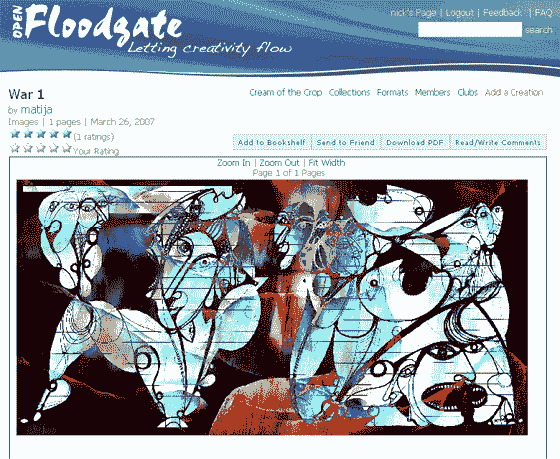

# OpenFloodgate:带控制的在线发布

> 原文：<https://web.archive.org/web/http://www.techcrunch.com:80/2007/03/29/openfloodgate-online-publishing-with-control/>

# OpenFloodgate:带控件的在线发布

[Openfloodgate](https://web.archive.org/web/20210429094505/http://openfloodgate.com/)，像 [Scribd](https://web.archive.org/web/20210429094505/http://www.beta.techcrunch.com/2007/03/06/scribd-youtube-for-text-gets-300k/) 一样，让内容创作者将他们的作品发布到网络上，但显然有更多的控制权。这个网站是斯坦福科技风险投资公司的执行董事兼创业学兼职教授蒂娜·齐莉格的项目。大约两周前，OpenFloodgate 最近发布了测试版，目前由网站用户上传各种故事、诗歌、歌词、照片、食谱等。一旦上传，每个作品都可以被评分，下载成 pdf 格式，并由其他用户评论。

OpenFloodgate 提供了比其他发布网站更多的控制。首先，该网站允许出版商限制哪些人可以看到他们的作品，或者只有你自己。此外，与其他文档共享网站不同，OpenFloodgate 将每部作品都发布为一系列图像文件或 pdf 文件，这使得剽窃作者的内容变得更加困难。这使得 OpenFloodgate 和类似的网站能够更好地处理用户生成内容带来的版权问题，并最终对这些内容收费。

