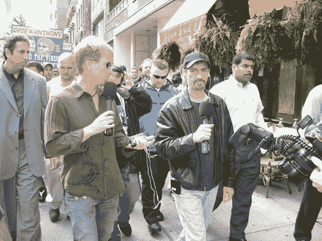

# Opie 和 Anthony 在停播一个月后重返 XM 卫星电台

> 原文：<https://web.archive.org/web/http://techcrunch.com/2007/06/15/opie-anthony-return-to-xm-satellite-radio-after-month-long-suspension/>

暂停结束了。在 XM [因为一些令人费解的原因暂停](https://web.archive.org/web/20140902020334/http://crunchgear.com/2007/05/16/opie-anthony-fans-cancel-xm-and-drestroy-their-radios-in-response-to-suspension/)一个月后，Opie & Anthony 今天重返卫星广播公司的广播频道，通过赠送他们正在推广的夏季[喜剧巡演](https://web.archive.org/web/20140902020334/http://www.myspace.com/virustour)的大量门票来庆祝。除了对 XM 的一个错误的一些抨击(在其网站上将该节目称为“Opie & Andy ”),广播相当平淡。没有反对 XM 的战斗号召，没有关于审查或言论自由死亡的咆哮，什么都没有。Greg“Opie”Hughes 确实提到 XM 必须再次“赢得”他们的信任，但是他与陌生人分享 Java 日志，所以不管怎样。

里奇·沃斯仍然是个傻瓜，帕特里斯已经失去了他所有的街头信誉，鲍勃·凯利的膝盖仍然骨折。换句话说，在他们疯狂的小世界里一切正常。

奥皮&安东尼

从 Wackbag 中窃取的图片(nfswblahblah)