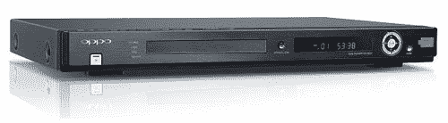

# Oppo 以 170 美元的价格推出 1080p、7.1 环绕声升级版 DVD 播放器

> 原文：<https://web.archive.org/web/http://techcrunch.com/2007/08/09/oppo-drops-1080p-71-surround-upscaling-dvd-player-at-170/>

# Oppo 以 170 美元的价格推出 1080p、7.1 环绕升级版 DVD 播放器

我对升级 DVD 播放器持怀疑态度。向上扩展基本上只是插值。所以你得不到真正的高清，你得到的是假高清。这可能看起来比标清要好，但它仍然不是真实的。有时它看起来很糟糕，尽管我见过一些看起来很棒的。

这就是为什么 Oppo Digital DV-980H 仍然没有定论。我敢肯定它在各方面都是一个神奇的 DVD 播放器，但升级让我很不爽。

DV-980H 据称是市场上第一款兼具 7.1 环绕声和 1080p 放大功能的 DVD 播放器，如果看起来不错，这是一个美味的组合。别担心，你的 5.1 也仍然受支持，DivX 也是，这是一个很好的特性。

除了热的内部部件，盒子还包括光学音频、分量输出和 HDMI，所以你知道它会看起来尽可能好，只需 170 美元。

[Oppo DV-980H](https://web.archive.org/web/20130628174610/http://www.oppodigital.com/dv980h/default.asp) 【产品页面，via [滑砖](https://web.archive.org/web/20130628174610/http://www.slipperybrick.com/2007/08/oppo-dv-980h/)