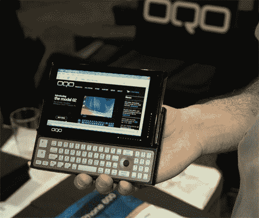

# OQO 02:它还活着

> 原文：<https://web.archive.org/web/http://techcrunch.com:80/2007/01/08/oqo-02-its-alive/>

# OQO 02:还活着

所以 OQO 01 没有浮上你的船…EVDO+无线和新的设计和键盘怎么样。加上 Vista，我们可能会有一个赢家。它仍然很贵——基本配置要 2000 美元——但它运行速度很快，非常有吸引力。以下是《动力》杂志的观点:

> 正如每个人所期待的那样，备受期待的 OQO 02 已经发布，可以在 Dynamism 上预订。OQO 02 仍然是世界上最小的全功能 Windows XP 机器。这款令人兴奋的新设备还具有 1.5GHz 处理器、1GB RAM、60GB 硬盘、集成 EV-DO 无线宽带、主动数字化触摸屏、触摸感应滚动区和超高亮户外可读 5”TFT。

[产品页面](https://web.archive.org/web/20130628153422/http://www.dynamism.com/oqo02/pricing.shtml)