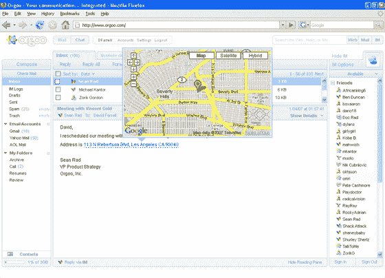

# orgoo——网络电子邮件/即时消息的替代品

> 原文：<https://web.archive.org/web/http://www.techcrunch.com:80/2007/05/14/orgoo-%20the-web-emailim-replacement%20/>

总部位于洛杉机的 Orgoo 是一项新的网络邮件服务，将会成为一些用户的热门应用。它不仅很好地模拟了 Outlook 风格的桌面邮件应用程序，还将所有主要 IM 提供商的即时消息直接集成到界面中。如果你正在寻找一个独立于服务的网络邮件/即时消息服务，你会想看看这个。

如果你还记得 2002 年发布的 Oddpost，你会发现它和 Orgoo 有相似之处。像 Oddpost 一样，Orgoo 是一种 Ajax 网络邮件服务，允许用户通过 POP 或 IMAP 访问他们最喜欢的电子邮件帐户。然而，Oddpost 服务的发展在 2004 年被雅虎收购时停止了。Oddpost 引擎的大部分现在已经集成到雅虎邮箱中。

Orgoo 与主要互联网网络邮件服务( [Gmail、Yahoo、Live Hotmail](https://web.archive.org/web/20081214062032/http://www.techcrunch.com/2007/02/08/a-comparison-of-live-hotmail-gmail-and-yahoo-mail/) 、 [AOL](https://web.archive.org/web/20081214062032/http://www.techcrunch.com/2007/03/08/new-aol-email-beta-cannot-compete-with-google-yahoo/) )的关键区别在于，它还集成了所有主要提供商的即时消息。

Orgoo 界面的主仪表板上同时有电子邮件和即时消息(点击图片查看大图)。登录 AIM、Live Messenger、Gtalk、ICQ、Yahoo)与联系人聊天(类似于 meebo/ebuddy)。你可以选择存档所有的即时通讯对话，并把它们放入你用来收发电子邮件的文件夹中——这是一种非常方便的整理信息的方式。由于 IM 存档的保存方式与电子邮件相同，用户也可以将 IM 对话作为电子邮件转发。

Gmail 和 Yahoo 都在他们的网络邮件应用程序中提供即时消息集成，但都不允许用户登录其他第三方服务。Gmail 只允许 Gtalk，雅虎只允许 Yahoo IM。Orgoo 是独立于服务的，所以那些在一个地方有电子邮件而在另一个地方有即时消息的用户(或者同时使用多个服务的用户)会发现这是一个更有用的应用。

我非常喜欢 Orgoo 的一点是他们对细节的关注。这方面有很多例子。用户可以从大量的视觉模板中进行选择，并可以上传电子邮件/即时消息的头像。电子邮件或即时消息中的任何地址都会变成一个链接，通过弹出窗口在谷歌地图中显示该地址。他们允许用户创建即时聊天室。他们允许用户录制快速的音频或视频文件，并通过电子邮件发送。参见下面的地图和视频截图。

Orgoo 将免费为用户提供 3 GB 的存储空间。这项服务目前仅在南加州大学的少数学生中进行私人测试，但将在未来几周内扩展到更大的群体。

两位创始人肖恩·拉德(20 岁)和沙赫扎德·蒂瓦纳(34 岁)是南加州大学的学生，他们请来经验丰富的老将迈克尔·坎特担任首席执行官。该公司已经筹集了一轮小规模的天使融资，目前只有 11 名员工(3 名在加州，8 名在巴基斯坦)。

外面有很多竞争对手。除了上面提到的 webmail 服务，许多服务都有很好的服务中立的 webmail 服务(参见我们对 Goowy 的[报道)。](https://web.archive.org/web/20081214062032/http://www.techcrunch.com/tag/goowy)[上市公司 Foldera](https://web.archive.org/web/20081214062032/http://www.techcrunch.com/2006/02/20/foldera-never-organize-your-inbox-again/) 也是一个直接竞争对手，但尚未推出(披露:我目前是 Foldera 的董事会成员)。

Orgoo 用一个非常小的团队创造了很多东西，而且到目前为止几乎没有融资。他们未来最大的挑战不是获得用户，而是证明他们的服务是可扩展的。对网络邮件最常见的抱怨之一是速度——即使拥有无限资源的 Gmail 和 Yahoo，也很难保持它们的服务运转。如果 Orgoo 能让这项服务继续发展，他们会很快变得非常受欢迎。

