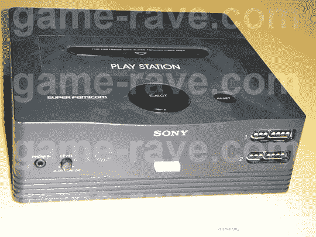

# 原创索尼/任天堂超级 Famicom 发现

> 原文：<https://web.archive.org/web/http://techcrunch.com/2007/06/08/original-sonynintendo-super-famicom-found/>

# 原索尼/任天堂超级 Famicom 发现

任何一个在维基百科上搜索视频游戏历史的玩家都应该知道，最初的索尼 Playstation 并不是我们都非常喜欢的灰色过热的 32 位游戏机。最初，任天堂聘请索尼公司帮助开发其超级家庭(SNES)游戏机。这种型号有一个 CD 驱动器，本质上是索尼 Playstation 的前身。最初的任天堂/索尼合作的一些原型仍然存在，但几乎不可能找到。

幸运的是，一些狡猾的游戏玩家能够得到一个旧的原型控制台。它看起来像是任天堂 64 和原始 Playstation 的结合，还带有一点世嘉土星的味道。目前对这个系统还不太了解，但它是一个工作模型，所以也许他们会有一些兼容的游戏可以尝试。每个字符 100 个多边形有人知道吗？

[Playstation 完美指南](https://web.archive.org/web/20130628201535/http://game-rave.com/)【游戏狂欢】