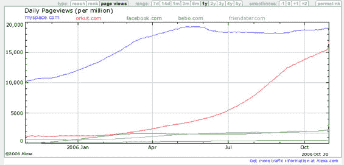
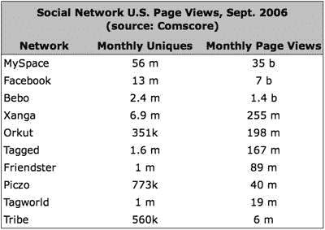

# Orkut 比 MySpace 大？好吧，也许不是——TechCrunch

> 原文：<https://web.archive.org/web/http://www.techcrunch.com:80/2006/11/01/orkut-bigger-than-myspace-ok-maybe-not/>

# Orkut 比 MySpace 大？好吧，也许不是

谷歌的 Orkut 在 Alexa 排行榜上稳步上升，今天第一次在总浏览量上超过了 MySpace。

由于所有其他指标都表明 MySpace 仍然远远大于 Orkut，我们看了一下康姆斯克的数据，它讲述了一个与 Alexa 不同的故事。康姆斯克 9 月份的数据(10 月份将在几周内公布)显示，MySpace 每天产生超过 10 亿的页面浏览量(9 月份总计 350 亿)，而 Orkut 整个月的页面浏览量约为 2 亿。因此，Myspace 一天之内就产生了 Orkut 每月 5 倍的页面浏览量。

为了好玩，我们还比较了 Alexa 和康姆斯克在其他大型社交网络上的表现。下面是两组数据。很明显，Alexa 在 Orkut 方面出了问题。据康姆斯克称，MySpace 的月访问量和页面浏览量仍然比下面列出的所有其他社交网络的总和还要多。

