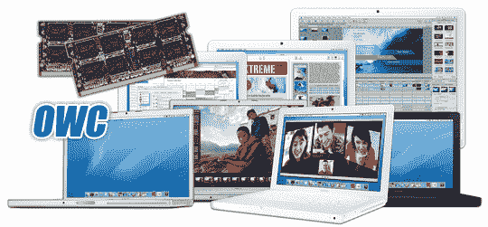

# OWC 宣布为 MacBook Pro  升级 4GB 内存

> 原文：<https://web.archive.org/web/http://techcrunch.com/2007/06/15/owc-announces-4gb-memory-upgrade-for-macbook-pro/>

Other World Computing 今天宣布，它将为 6 月 5 日之后发货的所有 MacBook Pros 发布 4GB 内存包。升级将包括两个 2GB 模块，价格约为出厂升级价格的三分之一，即 230 美元。如果你有 MacBook Pros，请随意研究这个问题，并通过电子邮件将你的体验发送给我们。或者，贝宝我的资金，所以我可以自己看看。

OWC 还宣布，它将为旧的 MacBook Pros 和 MacBook 提供 3GB 的升级。

[为 MBP](https://web.archive.org/web/20141011080246/http://eshop.macsales.com/item/Other%20World%20Computing/53IM2DDR4GBK/)【OWC】升级 4Gb