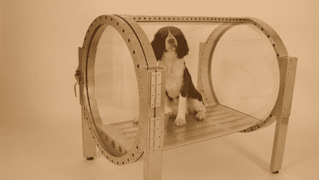

# Ownd Cafe:把你的狗送进氧气舱

> 原文：<https://web.archive.org/web/http://techcrunch.com:80/2007/07/31/ownd-cafe-treat-your-dog-to-an-oxygen-chamber/>

# Ownd 咖啡馆:把你的狗送进氧气舱

 
耶，他看起来很开心……

也许如果远东[更好地管理自己](https://web.archive.org/web/20130628181614/http://www.urbandictionary.com/define.php?term=regulate)的话，狗就不会在这个氧气室里呆上几个小时，我想这个氧气室被称为 Ownd 咖啡馆。它来自 AirPress，同样的前提也适用于人类——它是健康的，你会感觉更好，等等。—适用于这里的 Fido。交出你的钱包，看着你养尊处优的狗充氧。

为什么？只是为什么？

[产品页面(Kinda)](https://web.archive.org/web/20130628181614/http://www.air-press.com/)【Air Press via[秋叶原新闻](https://web.archive.org/web/20130628181614/http://www.akihabaranews.com/en/news-14480-Dogs+and+humans+at+the+same+level+with+AirPress.html)