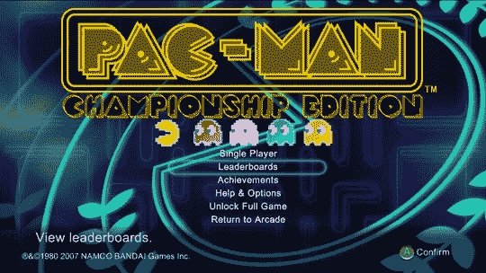

# 吃豆人首次亮相 Xbox Live Arcade:现在高清

> 原文：<https://web.archive.org/web/http://techcrunch.com/2007/06/06/pac-man-debuts-on-xbox-live-arcade-now-in-high-definiton/>

可爱的吃豆人[今天首次亮相 Xbox Live 街机，重生为*吃豆人冠军版*。游戏遵循地球上每个人都熟悉的相同前提，但增加了一堆新的迷宫和几项 21 世纪的改进，如高清图形和宽屏支持。微软与游戏的创造者合作，昨天在纽约举行了盛大的发布会，他们为第一个 Xbox 360 吃豆人世界冠军加冕，这个人来自墨西哥。](https://web.archive.org/web/20160510204101/http://www.penny-arcade.com/comic/1999/05/18)

这款游戏价值 800 微软积分，相当于 10 美元。或许这值得一试，至少能让你放松一下。

[吃豆人世界冠军](https://web.archive.org/web/20160510204101/http://www.xbox.com/en-US/games/p/pacmanlivearcadexbox360/worldchampionship/coverage.htm)【微软 via [路透社](https://web.archive.org/web/20160510204101/http://today.reuters.com/news/articlenews.aspx?type=technologyNews&storyid=2007-06-05T194406Z_01_N05257170_RTRUKOC_0_US-PACMAN-XBOX.xml)