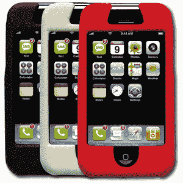

# 环太平洋地区已经有 iPhone 保护套让你去讨好了

> 原文：<https://web.archive.org/web/http://techcrunch.com/2007/06/18/pacific-rim-already-has-iphone-cases-for-you-to-fawn-over/>

晤小子，离 [iPhone 的](https://web.archive.org/web/20160202175202/http://crunchgear.com/category/iphone/) [推出](https://web.archive.org/web/20160202175202/http://crunchgear.com/2007/06/14/we-iz-sorri-iphone-lunch3-6pm/)只有 11 天了。如果你在发布日不知何故抢到了一部 iPhone，你可能会想要某种保护套来保护你的热门新玩具。因为让我们面对现实吧:这只是大人的玩具。)环太平洋的 iShield 应该让你的宝贝安然无恙，远离日常生活的恐怖。虽然没有屏幕保护，但合成皮革外壳看起来足够坚固，足以保护 iPhone 免受大多数轻微碰撞和擦伤。[最重于](https://web.archive.org/web/20160202175202/http://crunchgear.com/2007/04/09/update-body-armornot-ipodsaves-soldiers-life-in-iraq/)。

它只有 35 美元，虽然对于一块人造革来说似乎很贵，但还不到 iPhone 本身价格的 6%。

产品页面【环太平洋科技通过 [iLounge](https://web.archive.org/web/20160202175202/http://www.ilounge.com/index.php/ipod/review/pacific-rim-technologies-ishield-for-iphone/)