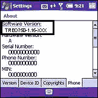

# Palm 发布 Treo 750 音频警报更新

> 原文：<https://web.archive.org/web/http://techcrunch.com:80/2007/07/21/palm-releases-treo-750-audio-alert-update/>

如果您的 Treo 750 失去了声音，导致您错过了非常重要的电话和消息通知，那么请放下手头的工作，集中注意力。并非每个 Treo 750 用户都受到影响，但如果您的软件版本为 TREO750-1.13-ATT 或 TREO750-1.13-CNG，那么您将需要此更新。那么到底是什么导致了这种声音警报的突然消失呢？根据 Palm 的说法，你，用户，使用音频驱动程序运行了太多的应用程序。安装更新之前，请确保通过活动同步备份所有内容。下面是怎么做的。

> 1.确保 Treo 750 已插入电源。
> 
> 2.通过单击下面的链接打开文件“Treo750AudioPatch-ATT.ppc.cab ”,并将其保存到格式化为 FAT32 的 miniSD 卡的根目录中。有关格式化 miniSD 卡的信息，请单击此处。
> 
> 3.将文件加载到 miniSD 卡后，将 miniSD 卡插入 Treo 750 设备。
> 
> 4.插入卡后，按设备上的开始，选择程序，然后选择文件资源管理器。
> 
> 5.从下拉菜单中选择存储卡，然后点击文件“Treo750AudioPatch-ATT.ppc.cab”。
> 
> 6.更新完成后，会有一条消息提示用户重启设备。选择确定，设备将重新启动。

[treo 750 audio patch-att . PPC . cab](https://web.archive.org/web/20150919104904/http://www.palm.com/cgi-bin/cso_eula.cgi?file=http://palmone.r3h.net/downloads.palm.com/Treo750AudioPatch-ATT.ppc.cab&next=/us/support/downloads/audio_alert_update.html&text=Then%20click%20here%20to%20return%20to%20the%20instructions.&template=/us/support/downloads/legal_template.html)【立即下载！！！]