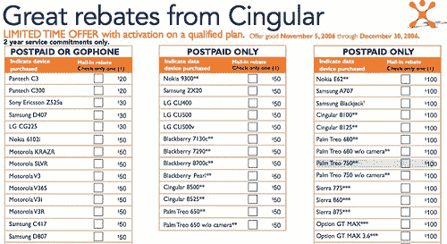

# Palm、三星将在圣诞节推出惊喜 QWERTY Fun(带 Cingular 回扣)！Palm、三星将在圣诞节推出惊喜 QWERTY Fun(带 Cingular 回扣)！

> 原文：<https://web.archive.org/web/http://techcrunch.com/2006/11/06/palm-samsung-to-drop-surprise-qwerty-fun-for-xmas-with-cingular-rebatespalm-samsung-to-drop-surprise-qwerty-fun-for-xmas-with-cingular-rebates/>

现金返还 bonanza 圣莫利！我们得到了两个独家新闻，都是基于 flickr 屏幕截图。有时 Cingular 自动悲剧地发布它不想发布的东西。哎呀，辛古拉！

我们在 flickr 上发现了这张图片。Cingular 是所有带有“Treo”和“GSM”字样的产品的橙色粉丝，它不仅准备在今年冬天推出预期的 Treo 680 ，还将推出以前只在欧洲销售的 750w。它与 680 的外形相似，但运行 Windows Mobile 5。这意味着 Cingy 将在圣诞节给我们两个 QWERTY 触摸屏 Palm 礼物。

不仅如此，他们还为注重安全的企业部署提供免摄像头版本。你能说无聊吗？我们知道你可以。

说到新的 QWERTY，(是的，我喜欢连字符，)寻找一个三星 i320 的美国 GSM 版本。这款摩托罗拉 Q/T-Mobile Dash/其他任何 Windows Mobile 5 QWERTY 非触摸屏竞争对手将在今年年底推出，并提供某种折扣。它将被称为“21 点”，这是一个对任何智能手机来说都有点太糟糕的名字。

【Cingular 的巨额回扣