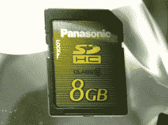

# 松下发布 8GB Pro 高速 SD 存储卡

> 原文：<https://web.archive.org/web/http://techcrunch.com/2007/07/30/panasonic-announces-8gb-pro-high-speed-sd-memory-card/>

# 松下发布 8GB Pro 高速 SD 存储卡

在今天早些时候推出两款高清摄像机的同时，松下宣布今天推出一款 8GB Pro 高速 SD 存储卡，它具有高速和高容量的特点。RP-SDV08GU1K 具有 6 级速度规格，相当于 6MB/s 的数据传输速度，并且与 SD 存储卡 v2.0 标准兼容。在 AVCHD 正常模式下，您可以存储大约两个小时的高清内容，或者大约 3，080 张图像。在 9 月份寻找 8GB 型号，价格为 159.99 美元。