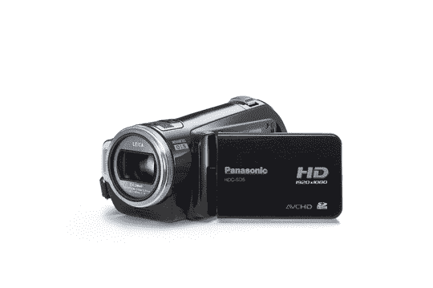
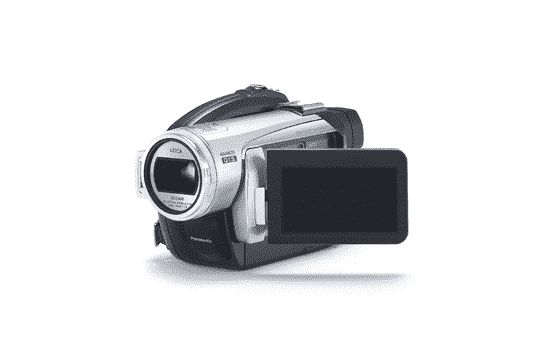

# 松下推出两款高清摄像机

> 原文：<https://web.archive.org/web/http://techcrunch.com/2007/07/30/panasonic-intros-two-hd-camcorders/>

# 松下推出两款高清摄像机

松下宣布了两款处于前沿的高清摄像机。成像技术的 t *咳*。HDC-SD5 和 HDC-SX5 在 AVCHD 格式下以 1，920×1，080 分辨率录制视频。这两款摄像机都配备了先进的光学图像稳定器，可以防止抖动。这两款机型还配备了徕卡迪考马镜头，8 组 12 个镜头元件，使用低色散光学玻璃来减少色彩模糊。

SD5 是世界上最小的 3CCD 高清摄像机，可以将视频录制到 SDHC/SD 卡上。SD5 采用了新的 USB 主机功能，极大地改善了数据存储和内容播放的便捷性。这两款相机都将于 9 月上市，售价分别为 999.95 美元(SD5)和 899.95 美元(SX5)。

