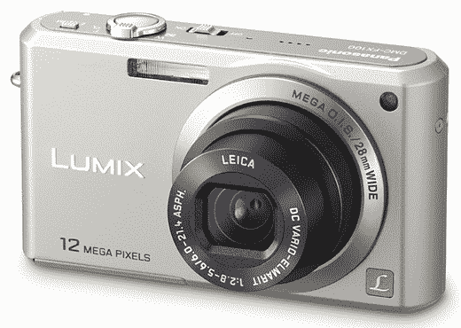

# 松下 Lumix FX100 凭借 1200 万像素大放异彩

> 原文：<https://web.archive.org/web/http://techcrunch.com/2007/05/21/panasonic-lumix-fx100-goes-buckwild-with-12-megapixels/>

松下今天发布了最新的 Lumix，这是一个大家伙。FX100 的尺寸可能很小，但 1200 万像素，28 毫米广角徕卡 DC 镜头，3.6 倍光学变焦和 f/2.8 讲述了一个不同的故事。我喜欢的一个很酷的功能是高速连拍模式，每秒拍摄八帧。它还拥有拍摄高清图片和以 15 FPS 录制 720p 视频的能力。最新的 Lumix 继承了我们已经喜欢上的 Mega O.I.S，它还包括一个宠物模式，可以给你的宠物拍照。没有价格方面的消息，但我们会在 7 月份看到这些辣妹。

[松下 Lumix DMC-FX100](https://web.archive.org/web/20150908044405/http://www.letsgodigital.org/en/14523/panasonic-lumix-dmc-fx100/)