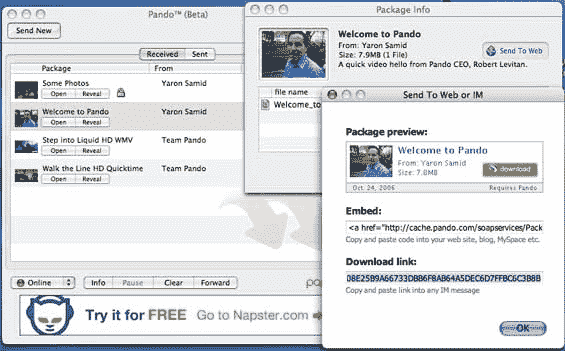

# Pando 超越电子邮件文件共享 TechCrunch

> 原文：<https://web.archive.org/web/http://www.techcrunch.com:80/2006/10/26/pando-moves-beyond-email-file-sharing/>

  总部位于纽约的 [Pando](https://web.archive.org/web/20221003220102/http://www.pando.com/) 已经脱离了 P2P 文件共享包[，我们在八月下旬已经对其进行了评估](https://web.archive.org/web/20221003220102/http://www.beta.techcrunch.com/2006/08/24/lets-share-some-files-four-services-compared/)。他们声称他们的客户端软件下载超过 150 万次，每天在用户之间移动多达 20 TB 的数据。

Pando 非常好用。一旦安装了 PC 或 Mac 软件，您只需将文件或文件夹(最大 1 GB)拖到打开的窗口中。Pando 立即开始将该文件上传到其服务器，并打开一个电子邮件表单。只需输入您希望接收文件的电子邮件地址，然后点击发送。当收件人打开电子邮件并点击小的。pando 附件，Pando 开始使用 Bittorent 从发件人的计算机以及 Pando 的服务器和任何其他接收文件的人传送文件。传输速度是不真实的-我的测试显示*最低*速度为 500 公里/秒，最高速度是这个数字的两倍。如果收件人的电脑上没有安装 Pando，下载开始前会提示他们安装。

Pando 是完全免费的，也有有用的 Outlook 插件和 Yahoo IM 插件

加州时间今天上午 9 点，Pando 打破了电子邮件的模式，发布了一款免费的新产品，允许人们直接从网站上分享文件。这可以通过嵌入或链接来实现，我在下面嵌入了一条来自 Pando 首席执行官 Robert Levitan 的消息作为例子。同样的文件也可以通过简单的[链接](https://web.archive.org/web/20221003220102/http://cache.pando.com/soapservices/Package/Welcome_to_Pando.pando?id=1DA2A4299675510DD5EF19D6B77C4DD20BD21434&key=A874C3B861305F2D834201908E25B9A66733DBB6F8AB64A5DEC6D7FFBC6C3B8B)来访问。

对于没有带宽来提供文件的播客和视频播音员来说，这将会非常有用。出版商甚至不需要将文件上传到他们自己的服务器上。他们只需将文件拖到 Pando 桌面软件中，就可以获得一个链接，添加到网站上。对于其他人来说，简单地添加一个 Pando 链接作为直接下载的附加选项也会很有吸引力。我们可能会在我们的 [TalkCrunch](https://web.archive.org/web/20221003220102/http://www.talkcrunch.com/) 播客中添加 Pando 链接，并作为帖子的附件提供该文件。听众可以简单地选择他们喜欢的选项，尽管如果他们选择 Pando，下载速度会快得多，我们也不必为他们的下载支付带宽费用。

Pando 的新产品如此高效，以至于也会招致滥用，尤其是来自共享版权材料的用户。Pando 表示，它将被动监控下载，并遵守从版权所有者那里收到的任何 DMCA 下架通知。

Pando 在这一领域已经有了一些竞争对手，特别是总部位于硅谷的 RedSwoosh，[，我们在 7 月](https://web.archive.org/web/20221003220102/http://www.beta.techcrunch.com/2006/07/05/use-red-swoosh-to-serve-files-for-free/)曾报道过。RedSwoosh 和 Pando 都有吸引人的产品。Pando 庞大的装机量可能会让它在划定地盘时占据优势。

Pando 在两轮融资中总共筹集了 1100 万美元。最近一轮 700 万美元的融资由英特尔投资公司牵头。

