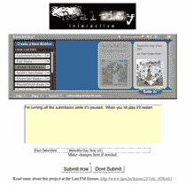

# Pandora 和 Last.fm 一起……有点像

> 原文：<https://web.archive.org/web/http://www.techcrunch.com:80/2006/03/29/pandora-and-lastfm-togethersort-of/>

# 潘多拉和 Last.fm 放在一起…算是吧

热爱音乐的人似乎要么是[潘多拉](https://web.archive.org/web/20220102132249/http://www.crunchbase.com/company/pandora)的乡亲，要么是 [Last.fm](https://web.archive.org/web/20220102132249/http://www.crunchbase.com/company/last.fm) 的乡亲，这两个群体经常意见相左(例如见对[本帖](https://web.archive.org/web/20220102132249/http://www.beta.techcrunch.com/2006/01/23/655/#comments)的评论)。

坦率地说，尽管有一些重叠，但这两个服务在不同方面都做得很好。潘多拉是发现基于你喜欢的新音乐的好地方。Last.fm 也擅长音乐发现，但你不能直接从他们的网站上播放音乐。

不过，last.fm 真正的亮点在于标记音乐和与朋友讨论音乐。因为 Last.fm 的社交方面，很多人喜欢在那里存储和标记他们喜欢的音乐。

好吧，对于这两个服务的核心用户来说，[Real-ity.com 已经创建了一个混搭](https://web.archive.org/web/20220102132249/http://www.real-ity.com/pandora/)(你需要一个 last.fm 账户来使用它)——一个在他们的服务器上运行的潘多拉播放器的克隆，有一个脚本可以将任何曲目直接提交到你的 last.fm 账户以便稍后标记，等等。该网站将自动确定歌曲和艺术家，尽管用户可以在提交到 Last.fm 之前编辑这些信息。

很粗糙，但很管用。它显示了新网络中用户操纵服务去做所有者可能从未想过的事情的力量。