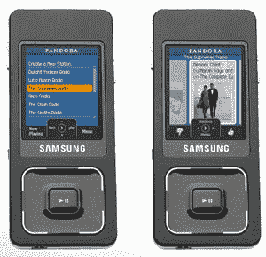
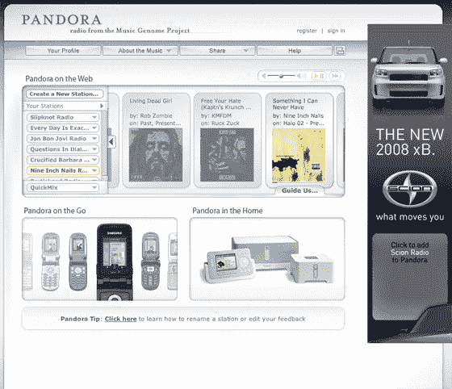

# Pandora 开始移动化，Sonos 等等 

> 原文：<https://web.archive.org/web/http://www.techcrunch.com:80/2007/05/22/pandora-goes-mobile-and-sonos-and-more/>

# 潘多拉开始移动，Sonos 等等

 音乐流媒体服务[潘多拉](https://web.archive.org/web/20230220010316/http://www.crunchbase.com/company/pandora)自推出以来，在过去两年中经历了大起大落。人们喜欢听他们的个性化电台，当你告诉它你喜欢什么和不喜欢什么时，它们会变得越来越个性化。但是最近他们必须为在互联网上播放音乐支付给 RIAA 的版税的变化将在未来几年内急剧上升。许可证的复杂性导致他们[屏蔽所有非美国听众](https://web.archive.org/web/20230220010316/https://techcrunch.com/2007/05/02/pandora-to-shut-out-non-us-users-thursday-evening/)。

然而今晚，潘多拉和它的用户正在庆祝。在旧金山现代艺术博物馆晚上 7 点的新闻发布会上，他们刚刚宣布了一系列新功能:
 **Pandora For Sprint**

在他们的第一笔移动交易中，Pandora 提供通过预装或下载的软件在许多 Sprint 手机上播放广播电台(将你的 Sprint 手机浏览器带到 Pandora.com，系统会提示你下载客户端)。这是 30 天免费的。之后，你必须有一个 Pandora premium 账户，每月 3 美元(这也可以删除 Pandora.com 的广告)。

**潘多拉对于索诺斯**

Sonos 现在支持潘多拉，所以你可以通过普通的家庭音响系统播放潘多拉音乐。Sonos 一直积极与合作伙伴达成交易。他们去年推出了 Rhapsody，今年早些时候宣布支持微软 DRM(T21)——这意味着来自 AOL Music Now、MTV Networks' URGE、Napster、沃尔玛、雅虎的音乐！音乐和 Zune Marketplace 现在可以在 Sonos 设备上播放。

**潘多拉之国**

潘多拉还重新设计了它的网站，以更好地整合听力和社区功能。该公司表示，他们现在有 690 万注册听众，他们播放了 47 亿首歌曲，投票数上升或下降了 5 亿次。他们说，这使他们成为世界上第三大网络电台。他们每天播放整个目录的 94%,所以他们正在深入音乐的长尾。

潘多拉也邀请了他们的一些重度用户参加今晚的活动。他们说，他们的重度用户平均每周听潘多拉音乐 18 个小时。

