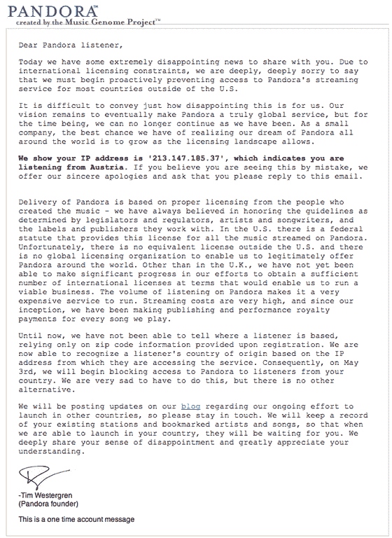

# Pandora 周四晚将非美国用户拒之门外

> 原文：<https://web.archive.org/web/http://www.techcrunch.com:80/2007/05/02/pandora-to-shut-out-non-us-users-thursday-evening/>

 如果你住在美国以外的地方，喜欢收听[潘多拉](https://web.archive.org/web/20230220120633/http://www.crunchbase.com/company/pandora)上定制的广播电台，请为一些坏消息做好准备。该网站将从周四晚上开始关闭你。从美国境外访问该服务的注册用户昨天收到了一封警告电子邮件，让他们知道这将发生。

Pandora 根据《DMCA》第 114 条运营，该条款为他们在美国向版权所有者支付费用提供了一个清晰的流程。国际上没有类似的《DMCA 》,因此要在其他国家合法运营，Pandora 必须直接与版权所有者签署协议。这意味着每首歌都要分别与唱片公司和发行商打交道，这是一项极其困难和耗时的任务。

Pandora 一直在网站上明确表示，它只面向美国用户，并且需要美国邮政编码才能注册。这并没有阻止许多国际用户注册，使用“90210”或另一个著名的邮政编码来获得服务。现在，有了基于 IP 的过滤，用户将被迫通过代理服务器或其他复杂的机制来获得音乐。

今晚，我与首席技术官汤姆·康拉德谈论了这一变化。他说，潘多拉已经从事国际版权交易近两年了，他们希望在英国和加拿大完成足够多的交易，以便很快在这些国家推出。他说，其他市场需要更长时间。

发送给用户的电子邮件如下。

这不是潘多拉最近唯一的坏消息。与其他互联网广播公司一起，他们也一直在与 RIAA 就修改在线播放音乐必须支付的费用结构进行斗争。他们支付的费用远远高于卫星提供商支付的费用，地面广播电台播放音乐不需要支付任何费用。两名非常勇敢的国会议员，众议员杰伊·因斯利(D-WA)和唐纳德·曼祖洛(R-IL)已经提议立法，要求互联网广播初创公司支付的费用不超过卫星提供商，这将允许许多互联网广播初创公司继续经营。在[潘多拉博客](https://web.archive.org/web/20230220120633/http://blog.pandora.com/pandora/archives/2007/04/legislation_to.html)和 [SaveNetRadio](https://web.archive.org/web/20230220120633/http://www.savenetradio.org/) 上阅读更多关于立法的内容。

自从潘多拉在 2005 年夏天推出以来，我们一直在报道它。我们的报道[在这里](https://web.archive.org/web/20230220120633/https://techcrunch.com/tag/pandora)。

