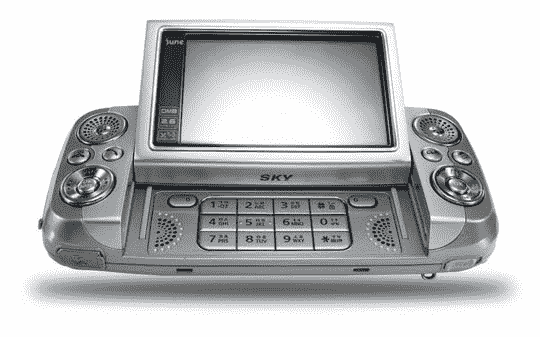

# 泛泰发射卫星 DMB 电话，美国未被邀请

> 原文：<https://web.archive.org/web/http://techcrunch.com:80/2006/09/05/pantech-launches-satellite-dmb-phone-us-not-invited/>

有时候看到我们得不到的东西总是很好的。以这个小小的 DMB 手机为例。它可以像一个助手一样打开，这样你就可以通过卫星连接观看 DMB 的视频，也许还可以发一点长短信。虽然我们永远不会在这里看到这一点，但这是一个非常酷的设计——如果衍生的话。

> 当用户按下屏幕旁边的按钮时，LCD 显示屏将自动以 30 度角弹出，从而优化用户的视角。显示屏大大增加了用户欣赏电影和电视节目的乐趣，最大限度地提高了手机的用户友好性。2.6 英寸宽的 QVGA LCD 是韩国 DMB 手机上最大的显示屏，进一步增强了便携式电视的观看体验。

一个人可以做梦，对吧？

[泛泰将推出“自动弹出显示”卫星 DMB 电话](https://web.archive.org/web/20160205084818/http://www.slashgear.com/pantech-to-launch-auto-pop-up-display-satellite-dmb-phone-051457.php)