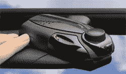

# Parrot MINIKIT 蓝牙扬声器

> 原文：<https://web.archive.org/web/http://techcrunch.com:80/2006/09/12/parrot-nomad-bluetooth-speakerphone/>

我不知道为什么这个产品过了三年才问世，但是它太棒了。Parrot 发布了它的蓝牙扬声器 MINIKIT 设备。它也不仅仅是一堆没用的垃圾。它有一个 2 瓦的扬声器，可以发出高清声音，DSP2 信号处理和语音识别。这是一个真正的免提设备，这就引出了一个问题:为什么没有更多这样的东西？在看到一半的美国人购买了一个看起来很傻的蓝牙耳机后，我想我们也会看到同样的对这种设备的抢购。希望我们不会看到人们走来走去谈论它们。那就糟了。

[Parrot 最新的蓝牙免提设备](https://web.archive.org/web/20131123013210/http://www.bluetomorrow.com/content/section/321/444/)【blue tomorrow via[Gizmodo](https://web.archive.org/web/20131123013210/http://www.gizmodo.com/gadgets/cellphones/parrot-nomad-goanywhere-bluetooth-device-200025.php)