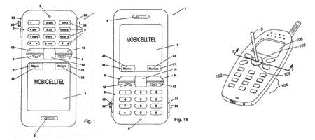

# 专利猴:惊人的诺基亚手机屏幕和游戏时间

> 原文：<https://web.archive.org/web/http://techcrunch.com/2007/02/22/patent-monkey-amazing-nokia-cell-phone-screen-and-game-time/>

# 专利猴:惊人的诺基亚手机屏幕和游戏时间

由于一些新发明的手机专利，在过去的几周里，诺基亚在锁定他们的技术方面作为顶级玩家受到了关注。值得注意的是，诺基亚最近获得了一项关于[任意方向手机显示屏](https://web.archive.org/web/20210410221140/http://www.patentmonkey.com/PM/PatentID/7181251.aspx)和[游戏手机适配器](https://web.archive.org/web/20210410221140/http://www.patentmonkey.com/PM/PatentID/7177604.aspx)的专利。诺基亚获得了一项专利，利用方位传感器可以显示任何方向的手机。如果你想知道的话，这不会影响到 [iPhone](www.apple.com/iphone/) ，因为它缩小到了一部带有“硬键”的手机。对于那些不到 500 美元的手机来说，拥有更宽的屏幕和通过 [Slingbox](https://web.archive.org/web/20210410221140/http://us.slingmedia.com/page/home) 连接视频的能力以及翻转显示屏的能力是一个很好的改进。

更轻松的是，诺基亚想出了一种方法，可以用手写笔在手机的操纵杆上快速滑动，或者用轨迹球在 PDA 上滑动。最酷的是让它成为索尼 PS3 或任天堂 Wii 的附加设备，你可以用它来控制你的手机。许多诺基亚手机已经有隆隆震动，蓝牙正在为 VOIP 添加，从上面你会有某种方向传感器为你的视频屏幕包起来。疯狂，但没那么疯狂。