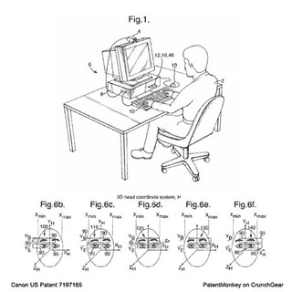
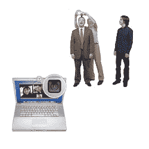

# 专利猴子:计算机眼球追踪

> 原文：<https://web.archive.org/web/http://techcrunch.com/2007/04/05/patent-monkey-eye-tracking-for-computers/>

随着人们对网络跟踪越来越感兴趣，像[点击密度](https://web.archive.org/web/20141020111825/http://clickdensity.com/)这样的玩家结合分析来微调偏好，我们认为佳能最近获得的[专利](https://web.archive.org/web/20141020111825/http://www.patentmonkey.com/PM/PatentID/7197165.aspx)覆盖了使用图像数据来跟踪电脑屏幕上的眼球运动非常有趣。

佳能在眼球追踪技术方面有着悠久的历史，并申请了这项技术来确定头部位置，然后凝视位置，然后通过将 2D 数据传输到 3D 计算机模型中来知道一个人正在看什么。此外，该模型可以跟踪帧到帧的变化，以促进“可靠和准确的眼睛跟踪”

知道苹果公司已经将摄像头集成到他们的笔记本电脑、iMacs 和显示器上，这项发明似乎准备弥合这一差距，允许计算机感知对屏幕特定元素的注意力，或者即使注意力在屏幕上而不是远离屏幕。这个怎么用？

例如:[微软美国专利 6618716–管理信息的传输](https://web.archive.org/web/20141020111825/http://www.patentmonkey.com/PM/PatentID/6618716.aspx)
微软一直在开发各种预测模型，试图通过基于多种属性确定传递消息的最佳周期来优化用户效率。显然，专注于屏幕和特定的计算机任务，比如在谷歌搜索时(用 Outlook 电子邮件分散注意力)与在 Word 中写一封信(不去管它)相比，有可能提高生产率。

为这项专利列出的[参考文献值得注意，因为这不是数字眼球追踪的第一次尝试，也肯定不会是最后一次。佳能的一个优点是，他们“根据为不同搜索区域生成的代表性图像值之间的关系来确定眼睛在三维空间中的位置。”](https://web.archive.org/web/20141020111825/http://www.patentmonkey.com/PM/relpatentid/7197165.aspx)