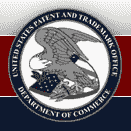

# 专利猴:专利申请符合社会评论

> 原文：<https://web.archive.org/web/http://techcrunch.com:80/2007/03/06/patent-monkey-patent-applications-meet-social-review/>

昨天在 [Washington Post](https://web.archive.org/web/20160420203856/http://www.washingtonpost.com/wp-dyn/content/article/2007/03/04/AR2007030401263_2.html?sub=AR) 上强调的，以及在 Patently-O 的知识产权博客 [Dennis Crouch 更广泛报道的，是即将推出的专利申请公开专利审查流程的新原型。](https://web.archive.org/web/20160420203856/http://www.patentlyo.com/patent/2007/02/community_revie.html)

为了给日益增长的[网络/技术社区的专利问题](https://web.archive.org/web/20160420203856/https://www.techpolicysummit.com/)建立一个可持续的解决方案，Beth Noveck 和纽约法学院的 Do-Tank 创建了[对等专利项目](https://web.archive.org/web/20160420203856/http://dotank.nyls.edu/communitypatent/)作为答案。

你对假冒专利搞乱你最喜欢的设备公司的弊病感到沮丧吗？有一种方法可以解决这个问题…

在诺维克女士的[白皮书](https://web.archive.org/web/20160420203856/http://dotank.nyls.edu/communitypatent/docs/openreview_sep_02.pdf)中，她提到了他们解决专利系统当前问题的驱动力:

> 与其他事后专利改革的提议不同，公开审查解决了法院无法解决的信息不足的核心问题。它不需要尝试任何法律上的改变，也不需要付出太多的努力就能实现。

前提是，专利通过的系统在审查员审查期间没有充分考虑非专利信息，这也是顶级科技公司中最流行的一个。同行评审过程试图在评审中注入更多的外部信息。

有趣的是，我们将看到该网络用来在贡献者中建立可信度的方法。专利同行设想使用 USPTO 审查员确定的“金星”奖励做出重大贡献的人，以及同行投票表决审查员应该考虑的主题的方式。诺维克女士还指出，随着时间的推移，在与 USPTO 的合作中，该系统将需要适应以找到正确的模式。听起来有点像创业。

有没有不好的一面？如果专利制度是用来奖励创新的，那么专家对现有技术的审查可以确保一个新的想法在发布前有一个检查点。考虑到成为一名评审者并没有很大的障碍(从他们的常见问题中似乎也没有)，那么许多人会看到许多专利申请根据需要提供评论。Slashdotters 多年来一直在做一个类似的过程，比起实际提交可能影响专利发放的信息，他们的动机更少。此外，专利审查员不需要使用这些信息，但是尽早收到高质量的结果会让时间紧张的审查员很难不被认为是一个额外的资源。

3 月 12 日，您将能够了解更多关于如何注册并成为同行评审员的信息。在[对等专利:社区专利](https://web.archive.org/web/20160420203856/http://dotank.nyls.edu/communitypatent/index.php)网站查看更新。