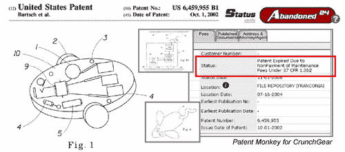

# 专利猴:P&G 考虑放弃机器人清洁器

> 原文：<https://web.archive.org/web/http://techcrunch.com:80/2007/05/17/patent-monkey-pg-considers-drops-robotic-cleaner/>

# 专利猴:P&G 考虑放弃机器人吸尘器

关于创新的一个事实是，尝试过的想法失败的次数比成功的次数多得多。通常，一个团队可以在市场中的任何人知道之前很久就关闭一个死项目。对于像 P&G 这样的公司来说，专利保护的概念是经过市场测试的，事后的清理是必要的。
 最近在满足一个想知道 P & G 在 Swiffer 上申请了什么专利的冲动的时候【我在这里找到的是】发现了 P & G 最近放弃的一个[机器人清洁设备专利](https://web.archive.org/web/20130628172805/http://www.patentmonkey.com/PM/patentid/6459955.aspx)。

是的，其中一张图片表明，P&G 开发团队正在考虑一个机器人清洁鼠标。它从未看到市场，专利正在被扼杀，这已经足够了。

如果你想知道 P&G 放弃了什么，这里有一些索赔形式的细节:

> 1.一种自主移动的家庭清洁机器人，包括:a)平台；
> b)连接到所述平台的原动力，所述原动力在具有边界的基本水平的表面上自主移动所述平台；c)用于存储、接收和传输数据的计算机处理单元，所述计算机处理单元附接到所述平台；
> d)与所述平台可操作地相关联的清洁工具；以及
> e)连接到所述原动力和所述计算机处理单元的动力源，由此所述计算机处理单元基于限定所述边界的输入数据来指导所述平台在水平面的边界内的水平移动，所述输入数据通过所述机器人的物理操纵或通过远程控制输入到所述机器人。

巧合的是，我看了这个遥控 WiiMote-iRobot 机器人 vac 视频，兴趣不大，主要是因为这个项目对程序员来说有点好玩。多亏了宝洁公司，至少有一项遥控机器人真空吸尘器的专利正在开源。

 [https://web.archive.org/web/20130628172805if_/http://www.youtube.com/embed/mj4lsNw3IG0?version=3&rel=1&fs=1&showsearch=0&showinfo=1&iv_load_policy=1&wmode=transparent](https://web.archive.org/web/20130628172805if_/http://www.youtube.com/embed/mj4lsNw3IG0?version=3&rel=1&fs=1&showsearch=0&showinfo=1&iv_load_policy=1&wmode=transparent)

视频

P&G 仍然持有另外两项机器人技术专利: [US 6941199](https://web.archive.org/web/20130628172805/http://www.patentmonkey.com/pm/patentid/6941199.aspx) 和 [US 6810305](https://web.archive.org/web/20130628172805/http://www.patentmonkey.com/pm/patentid/6810305.aspx) ，它们的费用将在未来两年内到期。