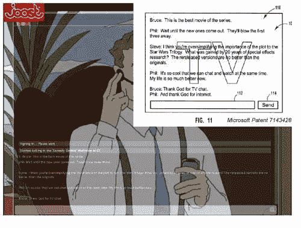
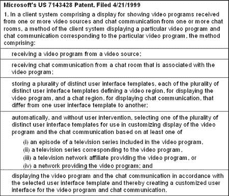

# PatentMonkey:微软将挑战 Joost？

> 原文：<https://web.archive.org/web/http://techcrunch.com:80/2007/06/08/patentmonkey-microsoft-to-take-on-joost/>

两件事表明，一家公司正在加速进入一项业务——申请专利和注册商标。

微软已经在在线视频领域做到了这两点，并且有能力挑战 Joost(T2)。最近提交的商标图像和 Joost 的外观与微软的[视频+聊天专利](https://web.archive.org/web/20160205214801/http://www.patentmonkey.com/PM/patentid/7143428.aspx)相匹配。

右边显示的符号最近被微软注册为商标，其商业描述如下:

> 通过宽带、电缆、卫星和无线网络传送广播质量视频和电视节目的计算机软件；用于提供视频点播服务的计算机软件；通过视频点播提供可下载的电影和电视节目；通过宽带、电缆、卫星和无线网络传输个人照片、视频和音乐的计算机软件；用于数字视频记录的计算机软件；和计算机软件，用于提供节目指南以显示可用的视频和电视广播和下载

有意思。当阅读微软最近获得的一项专利时更是如此，该专利涵盖了提供网络电视+聊天。随着 Joost 作为早期运营 IPTV 播放器的势头越来越大，微软可能会推出自己的产品。

作为概述，维基百科的 [Joost 条目](https://web.archive.org/web/20160205214801/http://en.wikipedia.org/wiki/Joost)将其技术描述为: *P2PTV 技术，预计将传送(转播)接近电视分辨率的图像。它将个人电脑变成即时点播电视，无需任何额外的机顶盒。通过使用半透明的窗口小部件覆盖，新闻更新、论坛、节目评级和多用户聊天会话(通常链接到活动流/频道)成为可能。*

考虑到 Joost 的描述，微软声明的一个例子是:

虽然这项专利可能是也可能不是 Joost 的直接问题，但微软获得标志、积累知识产权组合和最近购买广告平台 [aQuantive](https://web.archive.org/web/20160205214801/http://www.adweek.com/aw/national/article_display.jsp?vnu_content_id=1003587535) 的举动是一个建筑拼图的许多部分。

[微软商标视频服务](https://web.archive.org/web/20160205214801/http://www.techaddress.com/2007/05/21/microsoft-files-trademark-for-joost-like-service/)【tech address】
[微软增强型电视](https://web.archive.org/web/20160205214801/http://crunchgear.com/2007/06/07/patentmonkey-microsoft-enhanced-tv/)【CG】