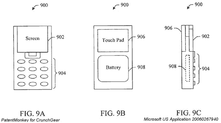

# PatentMonkey:微软的触摸屏手机

> 原文：<https://web.archive.org/web/http://techcrunch.com/2007/07/19/patentmonkey-microsofts-cell-phone-with-touch-screen/>

# PatentMonkey:微软的触摸屏手机

如果 Zune 是一部[手机](https://web.archive.org/web/20210124121128/http://crunchgear.com/2007/02/09/zne-phone-confirmed-launch-scenario-4g-wimax-action-rumors-off-the-wtf-o-meter/)会怎么样？如果在它的背面有一个触摸屏会怎么样？你能用它做什么？微软提交了一项专利申请，覆盖了一款可以用作个人电脑触摸屏鼠标的手机。在[上搜索](https://web.archive.org/web/20210124121128/http://crunchgear.com/2007/07/15/patentmonkey-patent-searching-411/)后，我们发现了微软的“双面手机触摸屏通过 WiFi 控制你的电脑”专利申请。咻，跳跃后的细节…

这一发现是在约翰和我上周讨论的类似苹果 Zune 的专利申请炒作之后出现的。在这个专利申请上还能有更多的东西联系起来吗？不太可能。

以下是他们所声称的:

> 1.一种便于在显示器上导航的系统，包括:检测位置的鼠标引擎组件；以及将鼠标引擎集成到手持通信设备中的接口组件。

简短明了。

让微软和苹果在手机领域的竞赛开始吧。坐下来，喝一杯，这可能会变得非常有趣，即使这些专利申请变得有点傻。