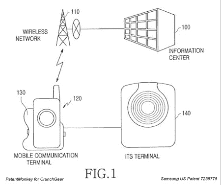

# PatentMonkey:三星的一键蜂窝 GPS 方向

> 原文：<https://web.archive.org/web/http://techcrunch.com/2007/07/04/patentmonkey-samsungs-one-push-cellular-gps-directions/>

凌晨时分回家、去酒店或去朋友家可能会变得更容易，这要归功于三星的新专利技术，该技术包括一种通过按下按钮使用手机从你所在的位置向期望的[目的地传输方向的方法。](https://web.archive.org/web/20160422004328/http://www.patentmonkey.com/pm/patentid/7236775.aspx)

我们只能说这个功能就像脸书开放开发者 API 平台一样聪明。一些潜在的混合应用程序的 GPS 功能后，跳转…

许多手机都嵌入了 GPS 追踪功能。当玩家们正在探索如何使用它来实现将你放在地图上的功能时，三星开发了一种方法来整合你所在的位置，并一步到位地为你提供方向。

具体来说，这项专利涵盖了在手机上调出一个地址的概念，按住一个按钮激活你所在位置的 GPS，并获得从你所在位置到你想去的地方的方向。就是这样。

因此，可以由此构建混搭服务:
Plaxo 出售一项服务，以摆脱某人的联系目录
Taco Bell、Starbucks 等。争相进入某人的联系目录

评论中还有更多值得你思考的地方。