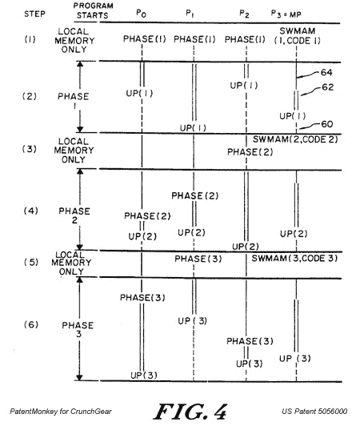

# PatentMonkey:索尼 PS3 下线，面临更多诉讼

> 原文：<https://web.archive.org/web/http://techcrunch.com/2007/08/02/patentmonkey-sony-ps3-down-kicked-with-more-litigation/>

索尼 PS3 不得不[通过](https://web.archive.org/web/20160301042507/http://games.slashdot.org/article.pl?sid=07/03/02/1335244&tid=212)的几起诉讼，现在可以将 PS3 cell 处理器添加到列表中。索尼是诉讼的接收方，声称 PS3 侵犯了一项近 20 年的专利(通过延续的魔力)。

并行处理公司，自称是国际并行机独家授权商，声称拥有[美国专利 5056000](https://web.archive.org/web/20160301042507/http://www.patentmonkey.com/PM/patentid/5056000.aspx) 的权利。细节和跳跃后的巨额索赔…

索尼的 PS3 工作在一个[单元微处理器](https://web.archive.org/web/20160301042507/http://en.wikipedia.org/wiki/Cell_microprocessor)上，这是 IBM、东芝和索尼努力允许 MMORRPGs 多处理的结果。当然，维基百科上说 IBM 的专利申请始于 2001 年，而 Parallel 的专利申请可以追溯到 1988 年。

在已发布的专利中包括两项独立权利要求，权利要求 1 是:

> 1.一种用于在多个阶段上并行处理数据的装置，包括:多个处理器，所述处理器中的任何一个作为主处理器工作，所述主处理器包括用于产生互连开关配置控制信号的装置；
> 用于互连每个所述处理器的通信总线，用于在每个所述处理器之间交换至少控制和同步信息；
> 多个多路存取存储器模块；连接到每个所述处理器和每个所述多路存取存储器模块的互连开关，并响应来自所述主处理器的所述互连开关控制信号，用于有选择地将任何一个或多个所述处理器与一个或多个所述多路存取存储器模块互连，从而在任何给定的处理阶段，任何一个所述多路存取存储器模块只与一个所述处理器互连；
> 每个所述处理器还包括本地存储器，由此一个或多个所述处理器在处理阶段之前、之后和期间处理其本地存储器中的数据；所述主处理器还包括用于通过所述通信总线向所述处理器中的另一个产生处理阶段开始信号的装置，所述开始信号指示并行数据处理的所述多个阶段中的每一个阶段的开始，在此期间所述多个处理器中的任何一个或多个处理器排他地与所述一个或多个多路存取存储器模块互连；并且每个所述处理器还包括用于通过所述通信总线向另一个所述处理器产生完成信号的装置，所述完成信号指示每个处理阶段的完成。

由于专利上列出了大量的现有技术，并且缺乏明显的现有竞争业务，索尼在下架所有 PS3 或销毁它们之前将有几个选择。

[Justia 联邦地区法院文件](https://web.archive.org/web/20160301042507/http://dockets.justia.com/docket/court-txedce/case_no-6:2007cv00353/case_id-104433/)
[索尼通过数字媒体线](https://web.archive.org/web/20160301042507/http://www.dmwmedia.com/news/2007/07/31/sony-hit-with-patent-suit-over-playstation-3-cell-processor)遭遇 PlayStation3 Cell 处理器专利诉讼
[索尼通过 GameSpot 面临另一起 PS3 诉讼](https://web.archive.org/web/20160301042507/http://au.gamespot.com/news/6175851.html)