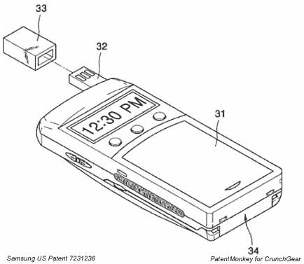

# PatentMonkey:手机上的 USB 集成天线——TechCrunch

> 原文：<https://web.archive.org/web/http://techcrunch.com/2007/06/13/patentmonkey-usb-integrated-antenna-on-cell-phone/>

# PatentMonkey:手机上的 USB 集成天线

智能，简单，适销对路。三星的[公适配器手机 USB 天线](https://web.archive.org/web/20200816220137/http://www.patentmonkey.com/PM/patentid/7231236.aspx)就是所有这些东西，然而，它是一个不容易被[发现的特征](https://web.archive.org/web/20200816220137/http://www.samsungtelecom.com/recommend/view_all.asp)。在路上不会丢失给我的手机充电的电线，只是一个友好的 USB 连接，通过一个端口从我包里的任何东西吸取能量，嗯，能量。这种普及将是一大便利。

更多描述以及为什么这种情况不会发生…

从专利来看:

> 本发明的无线通信设备包括具有用于数据通信的输入/输出端口 32 的主体 31，该输入/输出端口 32 与天线集成在一起。如图所示的无线通信设备是蜂窝电话，并且输入/输出端口 32 是从无线通信设备的主体 31 伸出的 USB 端口。在替代实施例中，输入/输出端口 32 可以是 IEEE 1394 端口。

因此，有一种很酷的 USB 天线[在 gadgetshop](https://web.archive.org/web/20200816220137/http://www.gadgetshop.com/pws/ProductDetails.ice?ProductID=277) 上出售，可以让电脑接收电视信号。也许 USB 手机天线不会破坏接收，这将是我最关心的问题。

好吧，这是我们下一部手机可能不会有这个功能的主要原因。手机配件是非常大的生意。具体来说，如果接口=专有，配件=利润。USB 不是专有的，因此，大多数公司不会纯粹基于一根遗忘的 20 美元的电缆在家里没有任何好处而获得甜蜜的售后利润流。

许愿:消费者在设计上的便利>对专有利润的需求。