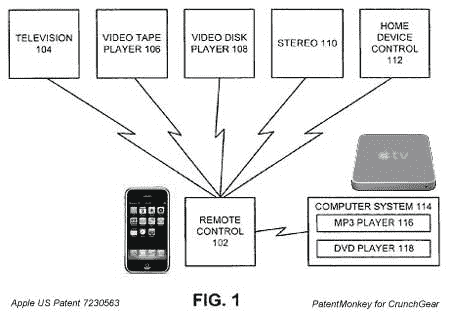
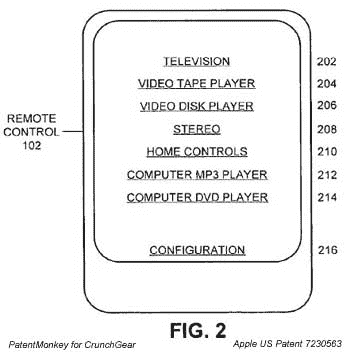

# patent monkey:iPhone 会被用作 Apple TV 遥控器吗？TechCrunch

> 原文：<https://web.archive.org/web/http://techcrunch.com:80/2007/06/20/patentmonkey-will-the-iphone-be-used-as-apple-tv-remote/>

所以 iPhone 的诞生可以追溯到 2005 年，[对吗？](https://web.archive.org/web/20170708012315/http://en.wikipedia.org/wiki/IPhone#History)有趣的是，苹果恰好在那个时候提交了一份专利申请的延续，该专利涉及一种用于控制许多家庭娱乐设备的[通用遥控器](https://web.archive.org/web/20170708012315/http://www.patentmonkey.com/PM/patentid/7230563.aspx)。

触摸屏，手持控制器，带有动态显示屏，可与您的娱乐设备交互信息，并可控制越来越多的媒体设备。跳完之后很 iPhone 的样子…

从这个和苹果更早的[通用遥控器](https://web.archive.org/web/20170708012315/http://www.patentmonkey.com/PM/patentid/6914551.aspx)专利，我们得到了这个界面和设备图像:

疯狂？也许用你 500 美元(或 1936 美元，取决于你如何计算)的 iPhone 来控制你的平板电脑是不符合逻辑的，但苹果公司在 MAC 电脑与数码相机、打印机和其他外围设备的集成方面确实有着出色的记录。

专利的一些细节:

> 1.一种通用遥控器，包括:显示屏，用户输入机构，处理单元，被配置为在显示屏上显示信息并从用户输入机构接受选择数据；以及无线通信机构，被配置为提供处理单元和电器之间的通信；其中，所述处理单元被配置为从所述设备接受显示信息，以在所述显示屏上显示；其中，所述处理单元还被配置为接受通过用户输入机构输入的信息，以与所述设备通信；其中所述无线通信机制被配置成周期性地广播发现命令；并且其中，如果电器在范围内，则该电器响应发现命令，以促进显示信息从电器到通用遥控器的通信；其中一组电器控制机制的标准图形表示存储在电器中，并且可以通过无线通信链路发送到通用遥控器以显示给用户。

好吧，所以几乎所有东西都是由红外控制的(iPhone 有红外是没有意义的)，但与这种趋势相反的是三星最近推出的 4600 美元的蓝牙高清电视，它声称这是世界上第一台。

苹果已经一次又一次地证明了它对易用性的考虑。摆弄一些代码，通过在苹果电视上试用，将 iPhone 变成万能遥控器，将是解决现代消费电子时代最大问题之一的开始(话说回来，也许不是，但这很酷)。