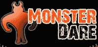

# 付钱在 Monster Dare  上羞辱你的朋友

> 原文：<https://web.archive.org/web/http://www.techcrunch.com:80/2007/06/28/pay-to-humiliate-your-friends-on-monster-dare/>

 病毒式视频网站的一个子集已经出现，专注于垂直行业。最近加入的一个是喜剧网站[搞笑或死亡](https://web.archive.org/web/20160914041929/http://funnyordie.com/)，当威尔·法瑞尔的小品《房东》在网上爆红(超过 36，539，017 次浏览)时，它掀起了波澜。怪物敢死队加入敢死队[的行列](https://web.archive.org/web/20160914041929/http://www.techcrunch.com/2006/12/12/darejunkies-is-a-social-networking-site-for-jackasses/)将敢死队带入社交视频。这个想法有点像 MTV 的《公驴》与竞争网站 Bix 混合的更柔和版本。

Monster Dare 是一个社交网络，你可以在你的朋友或公众身上下注。每一个挑战都被分为几类，比如浪漫的，挑战的，甚至是 x 级的。当一个挑战被宣布时，成员可以向钱罐捐款，以吸引任何人或特定的人去执行它。如果他们为观众提供照片或录像证明，他们可以大胆地收集。相比之下，Dare Junkies 有一个用户竞争的大底池，他们在网站上提出的任何挑战都可以获得高达 5000 美元的奖金。

由于 Monster Dare 的支付是通过 PayPal 进行的，他们在一定程度上陷入了交易费的困境，这可能会扼杀这项服务。如果你存 5 英镑，他们要收 50 便士，但存更多的钱就不收了。他们还统一收取 1.5 英镑的取钱费，并从赢得的 dare 基金中抽取 10%。