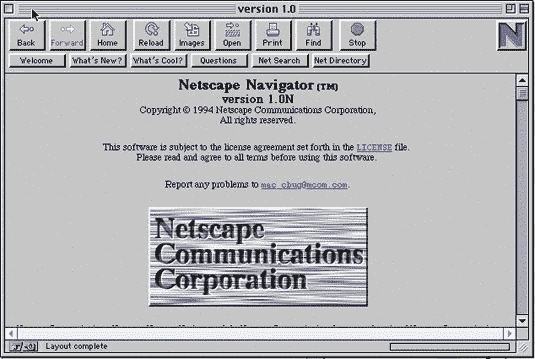

# PC 世界有史以来 50 款最佳科技产品——TechCrunch

> 原文：<https://web.archive.org/web/http://techcrunch.com:80/2007/04/03/pc-worlds-50-best-tech-products-of-all-time/>

# PC 世界有史以来 50 款最佳科技产品

令人难以置信的令人敬畏的杂志《个人电脑世界》已经公布了有史以来 50 大最佳科技产品名单，天哪，它充满了怀旧之情。经典游戏包括排名第 16 的 3dfx Voodoo3、排名第 8 的摩托罗拉 StarTAC、排名第 10 的俄罗斯方块和排名第 4 的 Napster。名单上最近的项目是暴雪的魔兽世界，排在第 27 位，其次是佳能 EOS 数码反叛，排在第 44 位。

那么谁是第一名呢？是麦克·OS X 吗？也许是任天堂游戏机？远非两者，实际上是网景导航器。是啊，没错。你在学校用来访问 LexisNexis 的 1994 年浏览器统治着所有的小工具和软件。诚然，网景是第一个做到这一切的主流浏览器，但在有史以来 50 个最佳科技产品中排名第一？Psh。PC 世界的爆炸方式。

[有史以来 50 款最佳科技产品](https://web.archive.org/web/20220121172035/http://www.pcworld.com/article/130207-1/article.html#netscape)【PC 世界】